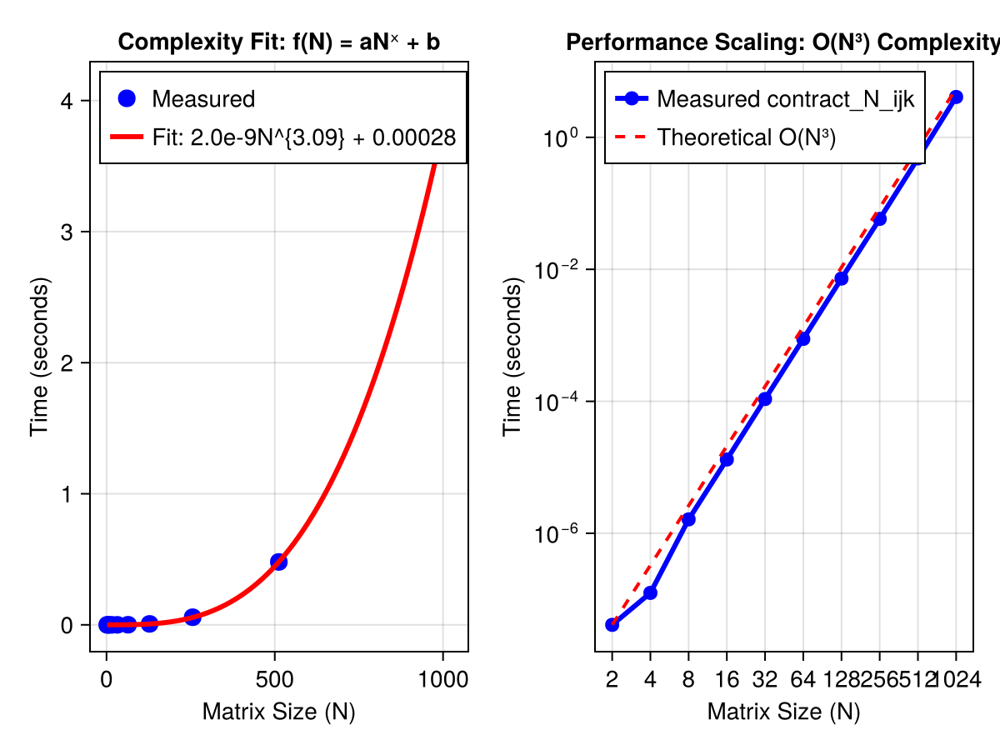

```@meta
EditURL = "task_5.jl"
```

# Task 1.5 — Contractions

!!! question "Task 1.5 — Contractions"
    Generate two random matrices $A, B$ each of size $N \times N$ and calculate the product
    ```math
    C_{i,j} = A_{i,k} B_{k,j},
    ```
    for a reasonable range of $N$ (this should still run in a reasonable amount of time).

A workaround to ensure that the data can be read during local testing as well as pages deployment build

````julia
DATA_ROOT = normpath(joinpath(@__FILE__, ".."));
````

!!! subquestion
    **A)** Without using any libraries

A naive implementation employs a explicit triple loop to individually compute the scalar multiplications and additions required to get the values of the resulting matrix. This straightforward approach can be specified in the form of a pseudocode algorithm [cormen_2009](@cite):

!!! algorithm "Square matrix multiply procedure"
    ```
    1  n = A.rows
    2  let C be a new n × n matrix
    3  for i = 1 to n
    4      for j = 1 to n
    5          c_ij = 0
    6          for k = 1 to n
    7              c_ij = c_ij + a_ik · b_kj
    8  return C
    ```

!!! subquestion
    **B)** Using a library of your choice

!!! subquestion
    Compare the run-time of the two approaches, as well as their scaling in $N$. Plot time vs. ``N`` and try to fit
    ```math
    f(N) = aN^x + b
    ```
    What do you observe?

````julia
using BenchmarkTools
using Qritical
using CairoMakie

Ns = [2, 4, 8, 16, 32, 64, 128, 256, 512, 1024]
results = []

for N in Ns
    # We use 'setup' to prepare data.
    bench = @benchmarkable contract_N_ijk($N, A=in_data[1], B=in_data[2], C=in_data[3]) setup = (
        in_data = setup_size_N_rand_input($N)
    )
    # Run the benchmark
    # run() returns a Trial object; we take the median time in seconds
    t = median(run(bench)).time / 1e9
    push!(results, t)
    println("N = $N: Completed in $t s")
end
````

````
N = 2: Completed in 4.1e-8 s
N = 4: Completed in 1.25e-7 s
N = 8: Completed in 1.625e-6 s
N = 16: Completed in 1.3125e-5 s
N = 32: Completed in 0.000108333 s
N = 64: Completed in 0.000883333 s
N = 128: Completed in 0.00724975 s
N = 256: Completed in 0.058127417 s
N = 512: Completed in 0.479874542 s
N = 1024: Completed in 4.0921708335 s

````

Curve Fitting

````julia
using LsqFit
````

Define the model: p[1]=a, p[2]=x, p[3]=b

````julia
@. model(n, p) = p[1] * n^p[2] + p[3]
````

````
model (generic function with 1 method)
````

Initial guess: a small value for a, 3 for exponent x (since it's ijk loop), 0 for b

````julia
p0 = [1e-9, 3.0, 0.0]
fit = curve_fit(model, Ns, results, p0)
a, x, b = coef(fit)

fig = Figure();
ax_1 = Axis(
    fig[1, 1];
    title="Complexity Fit: f(N) = aNˣ + b",
    xlabel="Matrix Size (N)",
    ylabel="Time (seconds)",
)
````

````
Makie.Axis with 0 plots:

````

Scatter the measured points

````julia
scatter!(ax_1, Ns, results; color=:blue, markersize=15, label="Measured")
````

````
Makie.Scatter{Tuple{Vector{GeometryBasics.Point{2, Float64}}}}
````

 Smooth line for the fitted curve

````julia
Ns_smooth = range(minimum(Ns), maximum(Ns); length=100)
lines!(
    ax_1,
    Ns_smooth,
    model(Ns_smooth, [a, x, b]);
    color=:red,
    linewidth=3,
    label="Fit: $(round(a, sigdigits=2))N^{$(round(x, digits=2))} + $(round(b, sigdigits=2))",
)
axislegend(ax_1; position=:lt)
````

````
Makie.Legend()
````

Comparing with theoretical reference log axes visualization
Setup the Axis with Log10 scaling

````julia
ax_2 = Axis(
    fig[1, 2];
    title="Performance Scaling: O(N³) Complexity",
    xlabel="Matrix Size (N)",
    ylabel="Time (seconds)",
    xscale=log10,
    yscale=log10,
    xgridvisible=true,
    ygridvisible=true,
    xticks=Ns,
)

line_measured = scatterlines!(
    ax_2,
    Ns,
    results;
    color=:blue,
    linewidth=3,
    markersize=12,
    label="Measured contract_N_ijk",
)
````

````
Makie.ScatterLines{Tuple{Vector{GeometryBasics.Point{2, Float64}}}}
````

Anchor the reference line to the first data point for comparison

````julia
ref_O3 = [results[1] * (n / Ns[1])^3 for n in Ns]

line_ref = lines!(
    ax_2, Ns, ref_O3; color=:red, linestyle=:dash, linewidth=2, label="Theoretical O(N³)"
)
axislegend(ax_2; position=:lt)
````

````
Makie.Legend()
````

fig

````julia
FIG_PATH = normpath(joinpath(DATA_ROOT, "contraction_bench.png"))
save(FIG_PATH, fig)
````



## Notes

On most computers there is a sizable difference between real and complex arithmetic. But no such distinction is made in what is given below.

!!! tip "How to do multilinear algebra on computers built and optimized for linear algebra?"
    Matrix multiplication is nothing but a special scenario of the more general operation of tensor contraction [shaw_1983](@cite). We can use this information to re-cast the required tensor contractions in the form of matrix multiplications which can be performed efficiently on modern computers.

Useful numerics related notes from [golub_vanloan_2013](@cite).

!!! algorithm "Dot Product"
    If ``x, y \in \mathbb{R}^n``, compute the dot product

    ```math
    c = x^j y_j
    ```

    ```
    c = 0
    for i = 1:n
        c = c + x[i]*y[i]
    end
    ```

    - Involves ``n`` multiplications and ``n`` additions.
    - It is an ``O(n)`` operation i.e. it scales linearly with dimension

!!! algorithm "Single-precision A times X Plus Y (SAXPY)"
    If ``x, y \in \mathbb{R}^n`` and ``a \in \mathbb{R}``, then this algorithm overwrites ``y_i`` with ``y_i + ax_i``.


    ```
    for i = 1:n
        y[i] = y[i] + a*x[i]
    end
    ```

    - It is also an ``O(n)`` operation

---

*This page was generated using [Literate.jl](https://github.com/fredrikekre/Literate.jl).*

