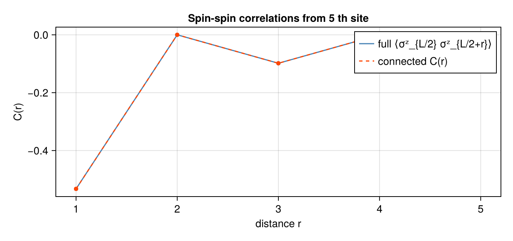

```@meta
EditURL = "ex_05.jl"
```

````julia
using LinearAlgebra, Serialization, Qritical
using CairoMakie
const DATA_ROOT = normpath(joinpath(@__FILE__, "..", "..", "data"))
ψ_raw  = deserialize(joinpath(DATA_ROOT, "psi.jls"))
N = ndims(ψ_raw);  d = size(ψ_raw, 1)
sites  = Tuple([upper(Symbol(:s, i), d) for i in 1:N])
mps    = to_mps(QTensor(ψ_raw, sites); trunc=MaxBondDimTrunc(32), form=:left)
println("MPS length: ", N, "  max bond dim: ", maximum(size(t.data, 3) for t in mps.tensors))
````

````
MPS length: 10  max bond dim: 32

````

# Ex 5. Vidal (Γ-Λ) Notation and Observables

**Week 5 — where this sits in the arc.** A mixed-canonical MPS (Weeks 3–4) makes
the Schmidt spectrum explicit at **one** bond — wherever the orthogonality centre
happens to be. Vidal's Γ–Λ form makes it explicit at **every** bond at once. That
single change is what lets us read the entanglement of the whole chain in one
glance and — crucially for Weeks 7–9 — apply a gate anywhere and re-centre for
free, which is the data structure TEBD is built on.

The Vidal form factors each left-canonical tensor $A_i = \Lambda_{i-1}\,\Gamma_i$
where $\Lambda_k = \mathrm{diag}(\lambda^{[k]}_1,\ldots)$ are the Schmidt values
at bond $k$.  All physical information is encoded in the $\Gamma\Lambda$ structure.

!!! info "One state, all cuts, simultaneously"
    Written symmetrically the state reads
    ```math
    |\psi\rangle = \sum \Gamma^{\sigma_1}\Lambda^{[1]}\Gamma^{\sigma_2}\Lambda^{[2]}
                   \cdots\Lambda^{[N-1]}\Gamma^{\sigma_N}\,|\vec\sigma\rangle .
    ```
    Absorbing the $\Lambda$ on either side of a chosen bond instantly gives the
    mixed-canonical form centred there, so observables at *any* site cost the
    $O(D^2 d^2)$ of the Eq.-97 shortcut without re-sweeping the chain. Vidal is
    mixed-canonical form "pre-computed everywhere at once."

## (a) Convert to Vidal form

`to_vidal(mps)` returns a new `FiniteMPS` in `VidalForm`.
The round-trip `to_canonical(to_vidal(mps))` should reproduce the original.

````julia
mps_v = to_vidal(mps)
println("After to_vidal: ", mps_v.form)
mps_back = to_canonical(mps_v)
println("Round-trip form: ", mps_back.form)
println("Round-trip ⟨ψ|ψ⟩: ", round(real(overlap(mps_back, mps_back)); sigdigits=10))
````

````
After to_vidal: VidalForm()
Round-trip form: CanonicalForm(10, 11)
Round-trip ⟨ψ|ψ⟩: 1.0

````

The $\Lambda_k$ are Schmidt coefficients, so $\sum_\alpha\lambda_\alpha^2$ is the
trace of the reduced density matrix across bond $k$ — it must equal $1$ at *every*
bond for a normalised state. Checking all bonds at once is a diagnostic unique to
the Vidal form (a canonical MPS only exposes the centre bond directly).
Normalization: Σ λᵢ² = 1 at every bond for a normalized MPS

````julia
println("Bond norms ‖Λₖ‖² (should be ≈ 1):")
for k in 1:N
    sv = mps_v.bond_svs[k+1].values
    println("  Bond $k: ", round(sum(abs2, sv); sigdigits=6))
end
````

````
Bond norms ‖Λₖ‖² (should be ≈ 1):
  Bond 1: 1.0
  Bond 2: 1.0
  Bond 3: 1.0
  Bond 4: 1.0
  Bond 5: 1.0
  Bond 6: 1.0
  Bond 7: 1.0
  Bond 8: 1.0
  Bond 9: 1.0
  Bond 10: 1.0

````

## (b) Entanglement entropy from the Λ spectra; observables on the canonical form

The real payoff of the Vidal form: the bond matrices $\Lambda_k$ **are** the
Schmidt values across bond $k$, so the bipartite entanglement entropy
$S_k = -\sum_\alpha \lambda_\alpha^2 \log_2 \lambda_\alpha^2$ is read off directly
from `mps_v.bond_svs`, with no contraction.

Expectation values, by contrast, are evaluated on the **canonical**
reconstruction `to_canonical(mps_v)`: Qritical's `local_expectation` /
`two_site_op` contract the bare site tensors, which reproduce the state only in
canonical form — not from the bare $\Gamma$ tensors (those carry inverse-$\Lambda$
factors and would overflow). The round-trip is exact, so these match the
original `mps`.

!!! warning "Never contract the bare $\Gamma$ tensors directly"
    A $\Gamma$ tensor is $\Gamma_i = \Lambda_{i-1}^{-1} A_i$: it hides an
    **inverse** Schmidt matrix. Whenever a $\lambda_\alpha$ is tiny (or an exact
    zero — common when the true bond rank is below the cap), $\lambda^{-1}$ blows
    up, and a naive contraction of bare $\Gamma$'s amplifies round-off
    catastrophically. This is why `to_vidal` uses a *pseudo-inverse* (zeros map to
    zeros) and why every observable here is measured on `to_canonical(mps_v)`,
    where the $\Lambda$'s have been reabsorbed and nothing is ever divided.

!!! note "What the entropy is telling you"
    $S_k$ is the von Neumann entropy of the reduced density matrix of either
    block, in **bits** (base-2 log). $S_k=0$ is a product cut, $S_k=\log_2\chi$ is
    maximal for bond dimension $\chi$. For a gapped 1D ground state $S_k$
    saturates to a constant as the block grows — the **area law** — which is the
    deep reason a *finite* bond dimension suffices and MPS methods work at all.

````julia
ops = algebra_generators(SpinHalf())
σz  = ops.Sz * 2
σx  = ops.Sp + ops.Sm
````

````
2×2 Matrix{ComplexF64}:
 0.0+0.0im  1.0+0.0im
 1.0+0.0im  0.0+0.0im
````

Entanglement entropy at each bond, straight from the Vidal Λ Schmidt values

````julia
entropy_bits(λ) = let p = abs2.(λ) ./ sum(abs2, λ)
    -sum(pα -> pα > 0 ? pα * log2(pα) : 0.0, p)
end
S_bond = [entropy_bits(mps_v.bond_svs[k+1].values) for k in 1:N-1]
println("Entanglement entropy per bond (bits):")
for k in 1:N-1
    println("  bond $k|$(k+1):  S = ", round(S_bond[k]; sigdigits=4))
end
````

````
Entanglement entropy per bond (bits):
  bond 1|2:  S = 1.0
  bond 2|3:  S = 0.7407
  bond 3|4:  S = 1.069
  bond 4|5:  S = 0.8773
  bond 5|6:  S = 1.093
  bond 6|7:  S = 0.8773
  bond 7|8:  S = 1.069
  bond 8|9:  S = 0.7407
  bond 9|10:  S = 1.0

````

Observables on the canonical reconstruction (normalized by ⟨ψ|ψ⟩)

````julia
mc   = to_canonical(mps_v)
nrm2 = real(overlap(mc, mc))
σz_site = [real(local_expectation(mc, σz, i)) / nrm2 for i in 1:N]
σx_site = [real(local_expectation(mc, σx, i)) / nrm2 for i in 1:N]
println("\n⟨σᶻᵢ⟩ = ", round.(σz_site; sigdigits=3))
println("⟨σˣᵢ⟩ = ", round.(σx_site; sigdigits=3))
````

````

⟨σᶻᵢ⟩ = [-3.09e-16, 3.73e-16, 1.6e-16, -2.76e-16, 3.09e-16, -1.5e-15, -4.16e-16, 1.36e-15, -3.33e-16, 6.66e-16]
⟨σˣᵢ⟩ = [-1.74e-16, 1.33e-16, -4.58e-16, 4.35e-16, -6.95e-16, 5.23e-16, -6.97e-16, 8.53e-16, -4.61e-16, 4.04e-16]

````

The Vidal→canonical round-trip is exact, so observables from the reconstruction
must match those of the original left-canonical `mps` — the ultimate check that
to_vidal/to_canonical preserved the physics and did not leak through the Λ⁻¹.
Cross-check: Vidal→canonical reproduces the original MPS observables

````julia
σz_orig = [real(local_expectation(mps, σz, i)) / real(overlap(mps, mps)) for i in 1:N]
println("Max |⟨σᶻ⟩_reconstructed − ⟨σᶻ⟩_original| = ",
        round(maximum(abs.(σz_site .- σz_orig)); sigdigits=4))
````

````
Max |⟨σᶻ⟩_reconstructed − ⟨σᶻ⟩_original| = 2.671e-16

````

## (c) Nearest-neighbour correlations $\langle \sigma^z_i \sigma^z_{i+1} \rangle$

The connected part $\langle\sigma^z_i\sigma^z_{i+1}\rangle_c$ strips off the
product of local magnetisations, leaving the genuine short-range correlation that
nearest-neighbour bonds carry.
Correlations on the canonical reconstruction (normalized)

````julia
zz_nn   = [real(two_site_op(mc, σz, σz, i, i+1)) / nrm2 for i in 1:N-1]
zz_c_nn = zz_nn .- σz_site[1:end-1] .* σz_site[2:end]
println("⟨σᶻᵢ σᶻᵢ₊₁⟩:      ", round.(zz_nn;   sigdigits=3))
println("Connected ⟨··⟩_c: ", round.(zz_c_nn; sigdigits=3))
````

````
⟨σᶻᵢ σᶻᵢ₊₁⟩:      [-0.736, -0.25, -0.558, -0.296, -0.532, -0.296, -0.558, -0.25, -0.736]
Connected ⟨··⟩_c: [-0.736, -0.25, -0.558, -0.296, -0.532, -0.296, -0.558, -0.25, -0.736]

````

## (d) Long-range correlations $\langle \sigma^z_{L/2}\,\sigma^z_{L/2+r} \rangle$

For distances $r \ge 2$ the transfer matrix between the two operator insertions
must be propagated explicitly. `two_site_op` handles arbitrary $(i,j)$.

!!! info "The connected correlator's decay is the correlation length"
    Between the two insertions sits a product of $r$ transfer matrices, so
    $C(r)=\langle\sigma^z_{L/2}\sigma^z_{L/2+r}\rangle_c$ decays like the leading
    sub-dominant eigenvalue $\eta_2$ of that transfer matrix: $C(r)\sim
    \eta_2^{\,r}=e^{-r/\xi}$ with $\xi=-1/\ln\eta_2$. Reading $\xi$ off this curve
    is how you extract the correlation length of the state — exponential decay
    signals a gapped phase, a straight line on a log plot.

````julia
l = N ÷ 2
corrs   = [real(two_site_op(mc, σz, σz, l, l+r)) / nrm2 for r in 1:N-l]
corrs_c = corrs .- [σz_site[l] * σz_site[l+r] for r in 1:N-l]
println("⟨σᶻ_{L/2} σᶻ_{L/2+r}⟩  and  connected C(r):")
for r in 1:N-l
    println("  r=$r:  full=$(round(corrs[r]; sigdigits=4))   connected=$(round(corrs_c[r]; sigdigits=4))")
end
````

````
⟨σᶻ_{L/2} σᶻ_{L/2+r}⟩  and  connected C(r):
  r=1:  full=-0.5325   connected=-0.5325
  r=2:  full=8.003e-17   connected=8.003e-17
  r=3:  full=-0.09834   connected=-0.09834
  r=4:  full=6.418e-17   connected=6.418e-17
  r=5:  full=-0.06095   connected=-0.06095

````

Plot the full and connected correlators against distance.

````julia
fig = Figure(size=(680, 320))
ax  = Axis(fig[1,1];
    title="Spin-spin correlations from $l th site",
    xlabel="distance r",  ylabel="C(r)",
    xticks=1:N-l,
)
lines!(ax, 1:N-l, corrs;   color=:steelblue, label="full ⟨σᶻ_{L/2} σᶻ_{L/2+r}⟩")
lines!(ax, 1:N-l, corrs_c; color=:orangered, linestyle=:dash, label="connected C(r)")
scatter!(ax, 1:N-l, corrs;   color=:steelblue, markersize=8)
scatter!(ax, 1:N-l, corrs_c; color=:orangered, markersize=8)
axislegend(ax)
fig
````





---

*This page was generated using [Literate.jl](https://github.com/fredrikekre/Literate.jl).*

