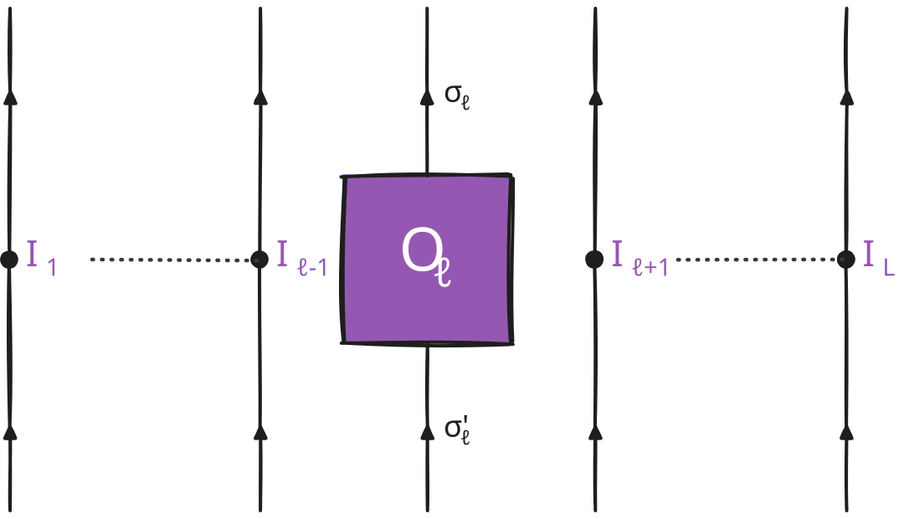
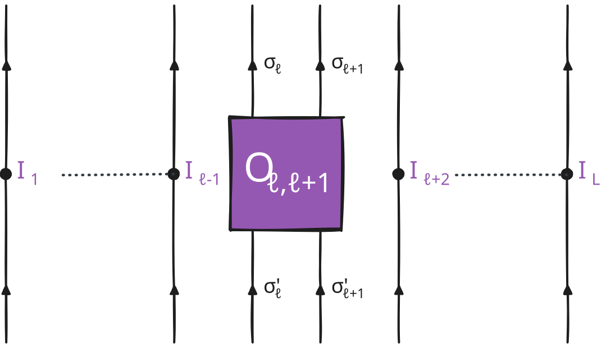
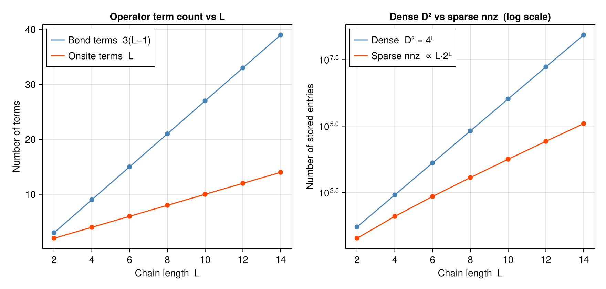
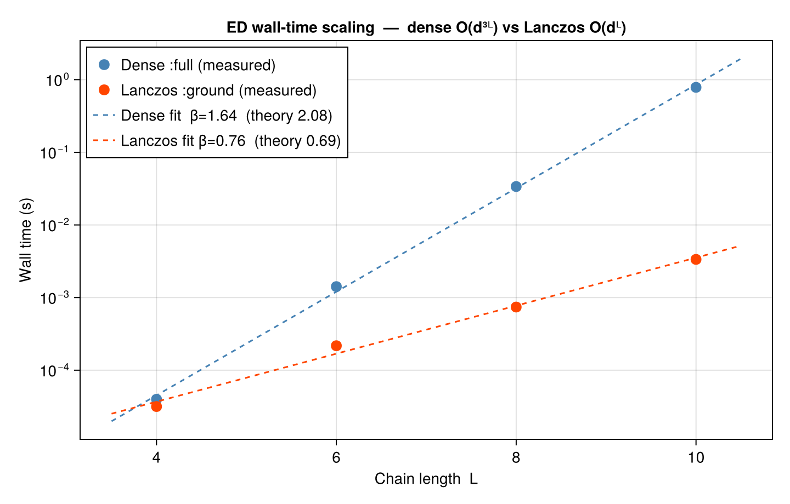

```@meta
EditURL = "ex_10.jl"
```

# Ex 10. A Toy ED Code

**Week 10 — the ground-truth reference.** Every tensor-network result so far has
been checked against "ED" — exact diagonalisation. This week we build that
reference ourselves, the honest way: embed the single-site spin operators into the
full $2^{L}$-dimensional Hilbert space with Kronecker products, assemble the XXZ
Hamiltonian as a (sparse) matrix, and hand it to a dense/sparse eigensolver. No
approximation, no bond dimension — and therefore no escape from the exponential
wall at $L\gtrsim 16$. That wall is *why* MPS exists; meeting it here, in a few
lines of `kron`, is the point of the exercise. Everything below doubles as the
oracle the earlier notebooks quietly rely on.

making sure that the correct julia project is activated instead of the current directory so all exports are available.

````julia
using Qritical
using LinearAlgebra
using SparseArrays # stdlib module support for sparse vectors and sparse matrices
````

arpack

## (a) Write the operators for $\alpha=x,y,z$ in the many-body Hilbert space.

The many-body Hilbert space for $L$ spin-½ sites is $\mathcal{H} = \bigotimes_{i=1}^{L} \mathbb{C}^2$, $D=2^L$.

The spin-½ matrices are
$$S^z = \tfrac12\begin{pmatrix}1&0\\0&-1\end{pmatrix},\quad
S^+ = \begin{pmatrix}0&1\\0&0\end{pmatrix},\quad
S^x = \tfrac{1}{2}(S^++S^-),\quad S^y = \tfrac{1}{2i}(S^+-S^-).$$

````julia
"""
    create_XXZ_L_spin_chain(L; Jxy=1.0, Jz=1.0, h=0.0)
Build an XXZ spin-½ chain of length `L` and return all commonly needed objects
as a named tuple so callers avoid boilerplate setup.
Keyword arguments:
- `Jxy` — transverse (flip-flop) coupling  (default 1.0)
- `Jz`  — longitudinal (Ising) coupling    (default 1.0)
- `h`   — on-site magnetic field           (default 0.0)
Returns `(; L, dof, lattice, H, ops, d)` where
- `dof` — `SpinHalf()` degree of freedom
- `lattice`   — `Chain(L)` geometry
- `H`   — `LatticeOperator` (XXZ Hamiltonian)
- `ops` — `NamedTuple` from `algebra_generators(SpinHalf())`
- `d`   — local Hilbert-space dimension (= 2)
"""
function create_XXZ_L_spin_chain(L; Jxy=1.0, Jz=1.0, h=0.0)
    dof = SpinHalf()
    lattice   = Chain(L)
    hamiltonian   = XXZ(lattice; J=Jxy, Jz=Jz, h=h)
    ops = algebra_generators(dof) # get the site operators that generate the correct operator algebra
    d   = local_dim(dof)
    return (; L, dof, lattice, hamiltonian, ops, d)
end
````

````
Main.var"##1137".create_XXZ_L_spin_chain
````

Default model used throughout part (a): L=4 isotropic Heisenberg

````julia
(; L, dof, lattice, hamiltonian, ops, d) = create_XXZ_L_spin_chain(4)
@show ops.Sz
@show local_dim(dof)
````

````
2
````

### (a.1) One-site operator $S^{\alpha}_i$

<div style="text-align: center">

<div>

\begin{equation}
\hat{O}_\ell = \left[O_{\ell}\right]^{{\sigma'}_{\ell}}_{{\sigma}_{\ell}} \ket{{\sigma'}_{\ell}} \bra{{\sigma}_{\ell}}
\end{equation}

Single-site: Sᶻ at site 2 embedded in the full 2^L Hilbert space

````julia
Sz_op_2  = op_at_site(lattice, dof, :Sz, 2)   # geometry required — sets the Kronecker-product size
Sz_mat_2 = matrix_repr(Sz_op_2)               # 16×16 dense matrix for L=4
@show size(Sz_mat_2)   # (16, 16)  — identity ⊗ Sz ⊗ identity ⊗ identity
````

````
(16, 16)
````

### (a.2) Two-site operator $S^{\alpha}_i S^{\alpha}_{i+1}$

<div style="text-align: center">

<div>

\begin{equation}
\hat{O}_{\ell,\ell+1}= \left[O_{\ell,\ell+1}\right]^{{\sigma'}_{\ell}{\sigma'}_{\ell+1}}_{{\sigma}_{\ell}{\sigma}_{\ell+1}} \ket{{\sigma'}_{\ell} {\sigma'}_{\ell+1}} \bra{{\sigma}_{\ell}{\sigma}_{\ell+1}}
\end{equation}

Two-site: Sz_1 Sz_2  (nearest-neighbour)

````julia
SzSz_12_op  = two_site_op(lattice, SpinHalf(), :Sz, 1, :Sz, 2)
SzSz_12_mat = matrix_repr(SzSz_12_op)
````

````
16×16 Matrix{ComplexF64}:
 0.25+0.0im   0.0+0.0im   0.0+0.0im   0.0+0.0im    0.0+0.0im    0.0+0.0im    0.0+0.0im    0.0+0.0im    0.0+0.0im    0.0+0.0im    0.0+0.0im    0.0+0.0im   0.0+0.0im   0.0+0.0im   0.0+0.0im   0.0+0.0im
  0.0+0.0im  0.25+0.0im   0.0+0.0im   0.0+0.0im    0.0+0.0im    0.0+0.0im    0.0+0.0im    0.0+0.0im    0.0+0.0im    0.0+0.0im    0.0+0.0im    0.0+0.0im   0.0+0.0im   0.0+0.0im   0.0+0.0im   0.0+0.0im
  0.0+0.0im   0.0+0.0im  0.25+0.0im   0.0+0.0im    0.0+0.0im    0.0+0.0im    0.0+0.0im    0.0+0.0im    0.0+0.0im    0.0+0.0im    0.0+0.0im    0.0+0.0im   0.0+0.0im   0.0+0.0im   0.0+0.0im   0.0+0.0im
  0.0+0.0im   0.0+0.0im   0.0+0.0im  0.25+0.0im    0.0+0.0im    0.0+0.0im    0.0+0.0im    0.0+0.0im    0.0+0.0im    0.0+0.0im    0.0+0.0im    0.0+0.0im   0.0+0.0im   0.0+0.0im   0.0+0.0im   0.0+0.0im
  0.0+0.0im   0.0+0.0im   0.0+0.0im   0.0+0.0im  -0.25+0.0im    0.0+0.0im    0.0+0.0im    0.0+0.0im    0.0+0.0im    0.0+0.0im    0.0+0.0im    0.0+0.0im   0.0+0.0im   0.0+0.0im   0.0+0.0im   0.0+0.0im
  0.0+0.0im   0.0+0.0im   0.0+0.0im   0.0+0.0im    0.0+0.0im  -0.25+0.0im    0.0+0.0im    0.0+0.0im    0.0+0.0im    0.0+0.0im    0.0+0.0im    0.0+0.0im   0.0+0.0im   0.0+0.0im   0.0+0.0im   0.0+0.0im
  0.0+0.0im   0.0+0.0im   0.0+0.0im   0.0+0.0im    0.0+0.0im    0.0+0.0im  -0.25+0.0im    0.0+0.0im    0.0+0.0im    0.0+0.0im    0.0+0.0im    0.0+0.0im   0.0+0.0im   0.0+0.0im   0.0+0.0im   0.0+0.0im
  0.0+0.0im   0.0+0.0im   0.0+0.0im   0.0+0.0im    0.0+0.0im    0.0+0.0im    0.0+0.0im  -0.25+0.0im    0.0+0.0im    0.0+0.0im    0.0+0.0im    0.0+0.0im   0.0+0.0im   0.0+0.0im   0.0+0.0im   0.0+0.0im
  0.0+0.0im   0.0+0.0im   0.0+0.0im   0.0+0.0im    0.0+0.0im    0.0+0.0im    0.0+0.0im    0.0+0.0im  -0.25+0.0im    0.0+0.0im    0.0+0.0im    0.0+0.0im   0.0+0.0im   0.0+0.0im   0.0+0.0im   0.0+0.0im
  0.0+0.0im   0.0+0.0im   0.0+0.0im   0.0+0.0im    0.0+0.0im    0.0+0.0im    0.0+0.0im    0.0+0.0im    0.0+0.0im  -0.25+0.0im    0.0+0.0im    0.0+0.0im   0.0+0.0im   0.0+0.0im   0.0+0.0im   0.0+0.0im
  0.0+0.0im   0.0+0.0im   0.0+0.0im   0.0+0.0im    0.0+0.0im    0.0+0.0im    0.0+0.0im    0.0+0.0im    0.0+0.0im    0.0+0.0im  -0.25+0.0im    0.0+0.0im   0.0+0.0im   0.0+0.0im   0.0+0.0im   0.0+0.0im
  0.0+0.0im   0.0+0.0im   0.0+0.0im   0.0+0.0im    0.0+0.0im    0.0+0.0im    0.0+0.0im    0.0+0.0im    0.0+0.0im    0.0+0.0im    0.0+0.0im  -0.25+0.0im   0.0+0.0im   0.0+0.0im   0.0+0.0im   0.0+0.0im
  0.0+0.0im   0.0+0.0im   0.0+0.0im   0.0+0.0im    0.0+0.0im    0.0+0.0im    0.0+0.0im    0.0+0.0im    0.0+0.0im    0.0+0.0im    0.0+0.0im    0.0+0.0im  0.25+0.0im   0.0+0.0im   0.0+0.0im   0.0+0.0im
  0.0+0.0im   0.0+0.0im   0.0+0.0im   0.0+0.0im    0.0+0.0im    0.0+0.0im    0.0+0.0im    0.0+0.0im    0.0+0.0im    0.0+0.0im    0.0+0.0im    0.0+0.0im   0.0+0.0im  0.25+0.0im   0.0+0.0im   0.0+0.0im
  0.0+0.0im   0.0+0.0im   0.0+0.0im   0.0+0.0im    0.0+0.0im    0.0+0.0im    0.0+0.0im    0.0+0.0im    0.0+0.0im    0.0+0.0im    0.0+0.0im    0.0+0.0im   0.0+0.0im   0.0+0.0im  0.25+0.0im   0.0+0.0im
  0.0+0.0im   0.0+0.0im   0.0+0.0im   0.0+0.0im    0.0+0.0im    0.0+0.0im    0.0+0.0im    0.0+0.0im    0.0+0.0im    0.0+0.0im    0.0+0.0im    0.0+0.0im   0.0+0.0im   0.0+0.0im   0.0+0.0im  0.25+0.0im
````

Two-site: Sz_1 Sz_3  (non-nearest-neighbour)

````julia
SzSz_13_op  = two_site_op(lattice, SpinHalf(), :Sz, 1, :Sz, 3)
SzSz_13_mat = matrix_repr(SzSz_13_op)
println("SzSz_12 diagonal (first 8): ", round.(real.(diag(SzSz_12_mat)[1:8]), digits=3))
````

````
SzSz_12 diagonal (first 8): [0.25, 0.25, 0.25, 0.25, -0.25, -0.25, -0.25, -0.25]

````

test : verify the spin algebra  [Sx, Sy] = i Sz  on the local matrices

````julia
Sx, Sy, Sz = ops.Sx, ops.Sy, ops.Sz
commutator = Sx * Sy - Sy * Sx
@assert norm(commutator - im * Sz) < 1e-14 "[Sx,Sy] ≠ iSz  (Condon–Shortley sign error)"
````

test : Verify Sz² eigenvalues: ±½ → (Sz²)_eigenvals = [¼, ¼]

````julia
sz_evals = sort(real.(eigvals(Sz)))
@assert sz_evals ≈ [-0.5, 0.5] atol=1e-14 "Sz eigenvalues are not ±½"
````

test : Single-site embedding: eigenvalues of Sz₂ in a 4-site chain should be four-fold degenerate ±½ (other sites are unconstrained)

````julia
evals_Sz2 = sort(unique(round.(real.(eigvals(Sz_mat_2)), digits=10)))
@assert evals_Sz2 ≈ [-0.5, 0.5] atol=1e-10 "Sz₂ embed: eigenvalues wrong"
println("local algebra and embedding checks passed ✓")
````

````
local algebra and embedding checks passed ✓

````

## (b) Construct from (a) the Hamiltonian $H$ of a XXZ spin chain

$$H = \sum_{i=1}^{L-1} \Bigl[ \tfrac{J}{2}(S_i^+ S_{i+1}^- + S_i^- S_{i+1}^+)
    + J_z\, S_i^z S_{i+1}^z \Bigr] - h \sum_i S_i^z.$$

── Build XXZ for L=6, J=Jz=1 (isotropic Heisenberg), no field ──────────────

````julia
(; L, hamiltonian) = create_XXZ_L_spin_chain(6)
println("Number of bond terms : ", length(hamiltonian.bond))
println("Number of onsite terms: ", length(hamiltonian.onsite))
M_dense = matrix_repr(hamiltonian)                    # gives the $2^L \times 2^L$ dense matrix
M_sparse = matrix_repr(hamiltonian, SparseFormat())    # SparseMatrixCSC - gives the sparse CSC version (same but faster for large $L$)
println("Dense shape : ", size(M_dense))
println("Sparse nnz  : ", nnz(M_sparse), " / ", prod(size(M_sparse)), " entries")

using CairoMakie
````

````
Number of bond terms : 15
Number of onsite terms: 6
Dense shape : (64, 64)
Sparse nnz  : 224 / 4096 entries

````

── Collect term counts and matrix fill statistics for a range of L ──────────
For an open XXZ chain:
  onsite terms  = L               (one Sz field term per site)
  bond terms    = 3(L−1)          (Sp⊗Sm, Sm⊗Sp, Sz⊗Sz per bond)
  dense entries = D²  = 4^L       (all elements of the full matrix stored)
  sparse nnz    ∝ L·D = L·2^L    (only matrix elements that couple two basis states)

````julia
function hamiltonian_density_vs_L(Ls)
    n_onsite_v   = Int[]
    n_bond_v     = Int[]
    dense_total  = Int[]
    sparse_nnz_v = Int[]
    for L in Ls
        H = create_XXZ_L_spin_chain(L).hamiltonian
        M = matrix_repr(H, SparseFormat())
        D = size(M, 1)
        push!(n_onsite_v,   length(H.onsite))
        push!(n_bond_v,     length(H.bond))
        push!(dense_total,  D^2)
        push!(sparse_nnz_v, nnz(M))
    end
    return n_onsite_v, n_bond_v, dense_total, sparse_nnz_v
end
Ls_v = collect(2:2:14)
n_onsite_v, n_bond_v, dense_total, sparse_nnz_v = hamiltonian_density_vs_L(Ls_v)
fig = Figure(size = (880, 420))
#= Left panel: bond and onsite term counts — both linear in L =#
ax1 = Axis(fig[1, 1];
    xlabel = "Chain length  L",
    ylabel = "Number of terms",
    title  = "Operator term count vs L",
    xticks = Ls_v,
)
lines!(ax1,   Ls_v, n_bond_v;   color = :steelblue, label = "Bond terms  3(L−1)")
scatter!(ax1, Ls_v, n_bond_v;   color = :steelblue, markersize = 10)
lines!(ax1,   Ls_v, n_onsite_v; color = :orangered,  label = "Onsite terms  L")
scatter!(ax1, Ls_v, n_onsite_v; color = :orangered,  markersize = 10)
axislegend(ax1; position = :lt)
#= Right panel: dense D² vs sparse nnz — log scale reveals the exponential gap =#
ax2 = Axis(fig[1, 2];
    xlabel = "Chain length  L",
    ylabel = "Number of stored entries",
    title  = "Dense D² vs sparse nnz  (log scale)",
    yscale = log10,
    xticks = Ls_v,
)
lines!(ax2,   Ls_v, dense_total;   color = :steelblue, label = "Dense  D² = 4ᴸ")
scatter!(ax2, Ls_v, dense_total;   color = :steelblue, markersize = 10)
lines!(ax2,   Ls_v, sparse_nnz_v;  color = :orangered,  label = "Sparse nnz  ∝ L·2ᴸ")
scatter!(ax2, Ls_v, sparse_nnz_v;  color = :orangered,  markersize = 10)
axislegend(ax2; position = :lt)
fig
````





test : Hermiticity, and known L=2 spectrum
Hermiticity

````julia
@assert norm(M_dense - M_dense') < 1e-13  "H is not Hermitian"
@assert norm(Matrix(M_sparse) - Matrix(M_sparse)') < 1e-13
````

test : Heisenberg L=2 exact spectrum: one singlet at −¾ J, three triplets at +¼ J

````julia
H2  = create_XXZ_L_spin_chain(2).hamiltonian
ev2 = sort(real.(eigvals(Hermitian(matrix_repr(H2)))))
@assert ev2 ≈ [-0.75, 0.25, 0.25, 0.25]  atol=1e-12  "L=2 spectrum incorrect"
````

test : Sparse and dense must agree

````julia
@assert norm(M_dense - Matrix(M_sparse)) < 1e-13  "dense ≠ sparse"
println("Hermiticity, L=2 spectrum, and sparse/dense consistency passed ✓")
````

````
Hermiticity, L=2 spectrum, and sparse/dense consistency passed ✓

````

## (c) Determine the GS of $H$ using a sparse eigenspectrum solver.

Qritical wraps KrylovKit's Lanczos under `ExactDiagonalization(:ground)`.  This
only computes the lowest eigenvalue and its eigenvector — cost $O(2^L)$ per
matrix–vector product, with the Krylov subspace kept small.

API: `solve(H, GroundState(), ExactDiagonalization(:ground))` → `EDResult`
with fields `.energy` and `.state`.

── Ground state, isotropic Heisenberg L=8 ──────────────────────────────────

````julia
(; L, hamiltonian) = create_XXZ_L_spin_chain(8)
gs = solve(hamiltonian, GroundState(), ExactDiagonalization(:ground))
println("GS energy (L=$L, Heisenberg): ", round(gs.energy, digits=8))
println("GS vector norm            : ", round(norm(gs.state), digits=14))
````

````
GS energy (L=8, Heisenberg): -3.3749326
GS vector norm            : 1.0

````

── Parameter scan: E₀(L) as a function of chain length ─────────────────────

````julia
Ls = [4, 6, 8, 10]
E0s = parameter_sweep(Ls) do L
    (; hamiltonian) = create_XXZ_L_spin_chain(L)
    solve(hamiltonian, GroundState(), ExactDiagonalization(:ground)).energy
end
println("L   E₀/L")
for (L, E) in zip(Ls, E0s)
    println("$L   ", round(E/L, digits=6))
end
````

````
L   E₀/L
4   -0.404006
6   -0.415596
8   -0.421867
10   -0.425804

````

Should approach the Bethe-ansatz value E/L → −ln2 + ¼ ≈ −0.4431 as L → ∞

── Check (c): GS energy matches dense eigensolver; GS is unit-norm ─────────

````julia
H6  = create_XXZ_L_spin_chain(6).hamiltonian
gs6 = solve(H6, GroundState(), ExactDiagonalization(:ground))
````

````
EDResult(-2.493577133887925, ComplexF64[-8.028584782526347e-18 - 7.256072675976173e-17im, 5.265004098091776e-17 - 6.846966663724805e-17im, -9.607096369504435e-17 - 6.512334325831682e-17im, 1.3526914549244857e-16 - 1.31571040950756e-17im, 1.488136058692449e-17 + 3.8072770235871896e-17im, 9.064958710088398e-18 + 2.062079948640492e-16im, -6.66513559814866e-17 - 7.509196227740535e-17im, -0.003287960069291271 - 0.00876397879964733im, -9.697204206278609e-17 - 1.2506523091099415e-16im, 1.6210833788004188e-17 - 1.5041313666072624e-16im, -3.656396648195381e-17 + 7.37101236212392e-18im, 0.021329504195779832 + 0.05685328247282992im, 3.247182896701107e-17 - 5.619089864108878e-17im, -0.04621040785617266 - 0.12317273514268874im, 0.02816886372968416 + 0.07508343146950622im, 7.886135833627459e-17 - 3.970439830824121e-18im, 3.289066656368468e-17 - 1.5371999155277704e-17im, -1.515985144503019e-16 - 1.3606100929193766e-16im, -9.29899570287643e-17 + 8.675364796915003e-17im, -0.04621040785617267 - 0.1231727351426889im, -1.0080494113520469e-17 - 9.79347561601547e-17im, 0.15785486090202347 + 0.4207583502268047im, -0.10835649297655957 - 0.28882163628446844im, 1.0904598928347027e-16 + 8.58072385247026e-17im, -1.6023585047464158e-16 - 3.4056238213668217e-17im, -0.08347558931616703 - 0.22250218361460966im, 0.10835649297655958 + 0.28882163628446844im, -2.0471934793055228e-17 - 7.063462951501755e-17im, -0.02816886372968386 - 0.07508343146950644im, 1.0686999521100593e-16 - 6.266750220858722e-17im, 2.545908138137313e-17 + 1.6802389689997798e-16im, 9.034737508875393e-17 - 4.983923565964509e-17im, -6.055274894373307e-17 - 1.1198864714564055e-17im, -1.2342855735621857e-16 + 4.0276567422289275e-17im, 1.1880019384885889e-17 - 6.437183425245027e-17im, 0.028168863729684142 + 0.07508343146950633im, 8.07099624669221e-17 + 2.5328074614232154e-17im, -0.10835649297655973 - 0.2888216362844685im, 0.0834755893161668 + 0.22250218361460947im, -2.7608483677869975e-17 + 3.091712140998372e-17im, -6.677358196022086e-17 - 4.995485850598718e-17im, 0.10835649297655964 + 0.2888216362844682im, -0.15785486090202366 - 0.4207583502268046im, -5.4267405035671456e-17 + 4.647954193364838e-17im, 0.04621040785617242 + 0.123172735142689im, 5.701696126324938e-17 - 1.1948584032246632e-17im, 1.1547049685330035e-16 - 1.5259154221943356e-16im, -1.305081015665752e-16 + 8.457948038318104e-17im, 1.5353482516105017e-16 + 5.983034429867199e-17im, -0.028168863729683954 - 0.07508343146950627im, 0.04621040785617245 + 0.12317273514268887im, 1.423484149457396e-16 - 1.254582560062409e-16im, -0.021329504195779732 - 0.0568532824728301im, -8.319665153407308e-17 + 1.7541648184253432e-17im, -1.9285144914469798e-16 - 3.5074537713678814e-17im, 1.8469289496521015e-17 + 8.724032227211664e-17im, 0.003287960069291337 + 0.008763978799647486im, 3.170207288093707e-17 + 8.062395695411604e-17im, 7.65184955813071e-17 - 2.7196641805556702e-17im, -1.346528114961554e-16 - 4.5916961204809377e-17im, 1.3575457349383965e-18 + 2.287771139733915e-17im, 6.161122398337501e-17 - 8.891948429240638e-17im, -1.9876219376212955e-16 + 6.819273412757456e-17im, -1.0850854478714339e-16 + 1.5520005733993472e-17im], [-2.493577133887925])
````

Dense reference

````julia
ev_dense = minimum(real.(eigvals(Hermitian(matrix_repr(H6)))))
@assert gs6.energy ≈ ev_dense  atol=1e-8  "Lanczos GS energy ≠ dense minimum"
@assert norm(gs6.state) ≈ 1.0  atol=1e-12  "GS not unit-norm"
````

GS must be eigenstate: H|ψ₀⟩ = E₀|ψ₀⟩ → ‖(H - E₀I)|ψ₀⟩‖ < tol

````julia
residual = norm((Matrix(matrix_repr(H6, SparseFormat())) - gs6.energy * I) * gs6.state)
@assert residual < 1e-8  "GS residual too large: $residual"
println("Part (c) ✓  —  E₀ matches dense, unit norm, eigenstate residual = ",
        round(residual, sigdigits=3))
````

````
Part (c) ✓  —  E₀ matches dense, unit norm, eigenstate residual = 2.77e-15

````

## (d) Determine the full eigenspectrum of $H$

`ExactDiagonalization(:full)` calls Julia's dense `eigen(Hermitian(M))` — cost
$O(d^{3L})$.  The result `.spectrum` contains **all** $2^L$ eigenvalues sorted
ascending.  Only practical for $L \lesssim 14$; the $2^{20}$ guard in
`matrix_repr(H, DenseFormat())` blocks accidental use on larger systems.

── Full spectrum of Heisenberg L=6 ─────────────────────────────────────────

````julia
(; hamiltonian) = create_XXZ_L_spin_chain(6)
full = solve(hamiltonian, GroundState(), ExactDiagonalization(:full))
println("Number of eigenvalues: ", length(full.spectrum))
println("Lowest  5: ", round.(full.spectrum[1:5],   digits=6))
println("Highest 5: ", round.(full.spectrum[end-4:end], digits=6))
println("Spectral width: ", round(full.spectrum[end] - full.spectrum[1], digits=6))
````

````
Number of eigenvalues: 64
Lowest  5: [-2.493577, -2.001995, -2.001995, -2.001995, -1.421462]
Highest 5: [1.25, 1.25, 1.25, 1.25, 1.25]
Spectral width: 3.743577

````

── Ising limit: Jz=2, J=0 ─── only SᶻSᶻ coupling ──────────────────────────
Spectrum is purely diagonal in the computational basis: each bond contributes
±Jz/4 depending on spin alignment → all eigenvalues in {-½Jz(L-1)/4, …}

````julia
H_ising = create_XXZ_L_spin_chain(4; Jxy=0.0, Jz=2.0, h=0.0).hamiltonian
ising   = solve(H_ising, GroundState(), ExactDiagonalization(:full))
println("Ising L=4 unique eigenvalues: ", sort(unique(round.(ising.spectrum, digits=6))))
````

````
Ising L=4 unique eigenvalues: [-1.5, -0.5, 0.5, 1.5]

````

── Check (d): spectrum must be real, sorted, match GS and L=2 analytics ────

````julia
H6    = create_XXZ_L_spin_chain(6).hamiltonian
full6 = solve(H6, GroundState(), ExactDiagonalization(:full))
@assert length(full6.spectrum) == 2^6  "Wrong number of eigenvalues: $(length(full6.spectrum))"
@assert issorted(full6.spectrum)  "Spectrum not sorted"
@assert full6.spectrum ≈ sort(full6.spectrum)  atol=1e-14
````

GS energy from :full must match :ground

````julia
gs6 = solve(H6, GroundState(), ExactDiagonalization(:ground))
@assert full6.energy ≈ gs6.energy  atol=1e-8  ":full GS ≠ :ground GS"
````

Trace = sum of eigenvalues = Tr(H) must be zero for traceless XXZ

````julia
@assert abs(sum(full6.spectrum)) < 1e-10  "Tr(H) ≠ 0: $(sum(full6.spectrum))"
println("Part (d) ✓  —  ", 2^6, " eigenvalues, sorted, Tr=0, GS consistent with Lanczos.")
````

````
Part (d) ✓  —  64 eigenvalues, sorted, Tr=0, GS consistent with Lanczos.

````

## (e) Write a time evolution code w.r.t to $H$ for a given initial state $|\Psi(t)\rangle = e^{-iHt}|\Psi_0\rangle$

The exact propagator diagonalises $H = V\Lambda V^\dagger$ **once**, then
evaluates $e^{-iHT}|\Psi_0\rangle = V\,\mathrm{diag}(e^{-i\lambda_k T})\,V^\dagger|\Psi_0\rangle$
at cost $O(d^{2L})$ per time point — no Trotter error, exact to machine precision.

API:
```julia
sv = as_statevector(ψ₀_vec)                      # wrap Vector{ComplexF64}
p  = ConstantProtocol(RealTime(), dt, nsteps, H)  # T = dt × nsteps
r  = solve(H, sv, ExactDiagonalization(:time), p) # EDTimeResult
r.state   # final |Ψ(T)⟩
r.time    # T
```

── Néel initial state |↑↓↑↓…⟩ quenched under Heisenberg ───────────────────

````julia
(; L, lattice, hamiltonian, d) = create_XXZ_L_spin_chain(6)
````

````
(L = 6, dof = SpinHalf(), lattice = Chain(6, false), hamiltonian = LatticeOperator{SpinHalf, Chain, OneSiteTerm{Matrix{ComplexF64}}, TwoSiteTerm}(SpinHalf(), Chain(6, false), OneSiteTerm{Matrix{ComplexF64}}[OneSiteTerm{Matrix{ComplexF64}}(1, ComplexF64[0.5 + 0.0im 0.0 + 0.0im; 0.0 + 0.0im -0.5 + 0.0im], -0.0), OneSiteTerm{Matrix{ComplexF64}}(2, ComplexF64[0.5 + 0.0im 0.0 + 0.0im; 0.0 + 0.0im -0.5 + 0.0im], -0.0), OneSiteTerm{Matrix{ComplexF64}}(3, ComplexF64[0.5 + 0.0im 0.0 + 0.0im; 0.0 + 0.0im -0.5 + 0.0im], -0.0), OneSiteTerm{Matrix{ComplexF64}}(4, ComplexF64[0.5 + 0.0im 0.0 + 0.0im; 0.0 + 0.0im -0.5 + 0.0im], -0.0), OneSiteTerm{Matrix{ComplexF64}}(5, ComplexF64[0.5 + 0.0im 0.0 + 0.0im; 0.0 + 0.0im -0.5 + 0.0im], -0.0), OneSiteTerm{Matrix{ComplexF64}}(6, ComplexF64[0.5 + 0.0im 0.0 + 0.0im; 0.0 + 0.0im -0.5 + 0.0im], -0.0)], TwoSiteTerm[TwoSiteTerm{Matrix{ComplexF64}, LinearAlgebra.Adjoint{ComplexF64, Matrix{ComplexF64}}}(1, 2, ComplexF64[0.0 + 0.0im 1.0 + 0.0im; 0.0 + 0.0im 0.0 + 0.0im], ComplexF64[0.0 - 0.0im 0.0 - 0.0im; 1.0 - 0.0im 0.0 - 0.0im], 0.5), TwoSiteTerm{Matrix{ComplexF64}, LinearAlgebra.Adjoint{ComplexF64, Matrix{ComplexF64}}}(2, 3, ComplexF64[0.0 + 0.0im 1.0 + 0.0im; 0.0 + 0.0im 0.0 + 0.0im], ComplexF64[0.0 - 0.0im 0.0 - 0.0im; 1.0 - 0.0im 0.0 - 0.0im], 0.5), TwoSiteTerm{Matrix{ComplexF64}, LinearAlgebra.Adjoint{ComplexF64, Matrix{ComplexF64}}}(3, 4, ComplexF64[0.0 + 0.0im 1.0 + 0.0im; 0.0 + 0.0im 0.0 + 0.0im], ComplexF64[0.0 - 0.0im 0.0 - 0.0im; 1.0 - 0.0im 0.0 - 0.0im], 0.5), TwoSiteTerm{Matrix{ComplexF64}, LinearAlgebra.Adjoint{ComplexF64, Matrix{ComplexF64}}}(4, 5, ComplexF64[0.0 + 0.0im 1.0 + 0.0im; 0.0 + 0.0im 0.0 + 0.0im], ComplexF64[0.0 - 0.0im 0.0 - 0.0im; 1.0 - 0.0im 0.0 - 0.0im], 0.5), TwoSiteTerm{Matrix{ComplexF64}, LinearAlgebra.Adjoint{ComplexF64, Matrix{ComplexF64}}}(5, 6, ComplexF64[0.0 + 0.0im 1.0 + 0.0im; 0.0 + 0.0im 0.0 + 0.0im], ComplexF64[0.0 - 0.0im 0.0 - 0.0im; 1.0 - 0.0im 0.0 - 0.0im], 0.5), TwoSiteTerm{LinearAlgebra.Adjoint{ComplexF64, Matrix{ComplexF64}}, Matrix{ComplexF64}}(1, 2, ComplexF64[0.0 - 0.0im 0.0 - 0.0im; 1.0 - 0.0im 0.0 - 0.0im], ComplexF64[0.0 + 0.0im 1.0 + 0.0im; 0.0 + 0.0im 0.0 + 0.0im], 0.5), TwoSiteTerm{LinearAlgebra.Adjoint{ComplexF64, Matrix{ComplexF64}}, Matrix{ComplexF64}}(2, 3, ComplexF64[0.0 - 0.0im 0.0 - 0.0im; 1.0 - 0.0im 0.0 - 0.0im], ComplexF64[0.0 + 0.0im 1.0 + 0.0im; 0.0 + 0.0im 0.0 + 0.0im], 0.5), TwoSiteTerm{LinearAlgebra.Adjoint{ComplexF64, Matrix{ComplexF64}}, Matrix{ComplexF64}}(3, 4, ComplexF64[0.0 - 0.0im 0.0 - 0.0im; 1.0 - 0.0im 0.0 - 0.0im], ComplexF64[0.0 + 0.0im 1.0 + 0.0im; 0.0 + 0.0im 0.0 + 0.0im], 0.5), TwoSiteTerm{LinearAlgebra.Adjoint{ComplexF64, Matrix{ComplexF64}}, Matrix{ComplexF64}}(4, 5, ComplexF64[0.0 - 0.0im 0.0 - 0.0im; 1.0 - 0.0im 0.0 - 0.0im], ComplexF64[0.0 + 0.0im 1.0 + 0.0im; 0.0 + 0.0im 0.0 + 0.0im], 0.5), TwoSiteTerm{LinearAlgebra.Adjoint{ComplexF64, Matrix{ComplexF64}}, Matrix{ComplexF64}}(5, 6, ComplexF64[0.0 - 0.0im 0.0 - 0.0im; 1.0 - 0.0im 0.0 - 0.0im], ComplexF64[0.0 + 0.0im 1.0 + 0.0im; 0.0 + 0.0im 0.0 + 0.0im], 0.5), TwoSiteTerm{Matrix{ComplexF64}, Matrix{ComplexF64}}(1, 2, ComplexF64[0.5 + 0.0im 0.0 + 0.0im; 0.0 + 0.0im -0.5 + 0.0im], ComplexF64[0.5 + 0.0im 0.0 + 0.0im; 0.0 + 0.0im -0.5 + 0.0im], 1.0), TwoSiteTerm{Matrix{ComplexF64}, Matrix{ComplexF64}}(2, 3, ComplexF64[0.5 + 0.0im 0.0 + 0.0im; 0.0 + 0.0im -0.5 + 0.0im], ComplexF64[0.5 + 0.0im 0.0 + 0.0im; 0.0 + 0.0im -0.5 + 0.0im], 1.0), TwoSiteTerm{Matrix{ComplexF64}, Matrix{ComplexF64}}(3, 4, ComplexF64[0.5 + 0.0im 0.0 + 0.0im; 0.0 + 0.0im -0.5 + 0.0im], ComplexF64[0.5 + 0.0im 0.0 + 0.0im; 0.0 + 0.0im -0.5 + 0.0im], 1.0), TwoSiteTerm{Matrix{ComplexF64}, Matrix{ComplexF64}}(4, 5, ComplexF64[0.5 + 0.0im 0.0 + 0.0im; 0.0 + 0.0im -0.5 + 0.0im], ComplexF64[0.5 + 0.0im 0.0 + 0.0im; 0.0 + 0.0im -0.5 + 0.0im], 1.0), TwoSiteTerm{Matrix{ComplexF64}, Matrix{ComplexF64}}(5, 6, ComplexF64[0.5 + 0.0im 0.0 + 0.0im; 0.0 + 0.0im -0.5 + 0.0im], ComplexF64[0.5 + 0.0im 0.0 + 0.0im; 0.0 + 0.0im -0.5 + 0.0im], 1.0)]), ops = (Sx = ComplexF64[0.0 + 0.0im 0.5 + 0.0im; 0.5 + 0.0im 0.0 + 0.0im], Sy = ComplexF64[0.0 - 0.0im 0.0 - 0.5im; 0.0 + 0.5im 0.0 - 0.0im], Sz = ComplexF64[0.5 + 0.0im 0.0 + 0.0im; 0.0 + 0.0im -0.5 + 0.0im], Sp = ComplexF64[0.0 + 0.0im 1.0 + 0.0im; 0.0 + 0.0im 0.0 + 0.0im], Sm = ComplexF64[0.0 - 0.0im 0.0 - 0.0im; 1.0 - 0.0im 0.0 - 0.0im], I = ComplexF64[1.0 + 0.0im 0.0 + 0.0im; 0.0 + 0.0im 1.0 + 0.0im]), d = 2)
````

Build the Néel state directly as a computational-basis vector.
Basis convention (big-endian, site 1 most significant):
  index k = 1 + Σᵢ (σᵢ - 1) · d^(L-i),  σᵢ ∈ {1(↑), 2(↓)}
Néel pattern: odd sites ↑ (σ=1, contributes 0), even sites ↓ (σ=2, contributes 1·d^(L-i))

````julia
neel_idx = 1 + sum(iseven(i) ? d^(L - i) : 0 for i in 1:L)
ψ₀ = zeros(ComplexF64, d^L)
ψ₀[neel_idx] = 1.0
sv = as_statevector(ψ₀)
println("Néel state index (1-based, big-endian): ", neel_idx, "  (out of ", d^L, ")")
println("‖ψ₀‖ = ", norm(ψ₀))
````

````
Néel state index (1-based, big-endian): 22  (out of 64)
‖ψ₀‖ = 1.0

````

── Evolve and measure staggered magnetisation M_stag(t) = ⟨Ψ(t)|(−1)ⁱSᶻᵢ|Ψ(t)⟩ ──

````julia
T_max  = 5.0
n_t    = 50
dt     = T_max / n_t
````

````
0.1
````

Assemble staggered magnetisation on the shared lattice geometry.
ops.Sz is already the local 2×2 matrix; no need to call algebra_generators again.

````julia
stag_terms = [OneSiteTerm(i, ops.Sz, (-1.0)^i) for i in 1:L]
M_stag_op  = LatticeOperator(dof, lattice, stag_terms, TwoSiteTerm[])
M_stag_mat = matrix_repr(M_stag_op)
times  = Float64[]
mstag  = Float64[]
ψ = copy(ψ₀)
for step in 1:n_t
    p = ConstantProtocol(RealTime(), dt, 1, hamiltonian)
    r = solve(hamiltonian, as_statevector(ψ), ExactDiagonalization(:time), p)
    global ψ = r.state
    push!(times, dt * step)
    push!(mstag, real(dot(ψ, M_stag_mat * ψ)))
end
println("t=0                → M_stag = ", real(dot(ψ₀, M_stag_mat * ψ₀)))
println("t=", round(T_max, digits=1), "             → M_stag = ", round(mstag[end], digits=6))
println("(value at t=0 is −L/2 = ", -L/2, " for the perfect Néel state)")
````

````
t=0                → M_stag = -3.0
t=5.0             → M_stag = 0.524811
(value at t=0 is −L/2 = -3.0 for the perfect Néel state)

````

── Alternatively: propagate the full interval in one shot ──────────────────

````julia
T_total = 5.0
p_full  = ConstantProtocol(RealTime(), T_total, 1, hamiltonian)
r_full  = solve(hamiltonian, sv, ExactDiagonalization(:time), p_full)
println("One-shot final state norm : ", round(norm(r_full.state), digits=14))
println("Total time returned       : ", r_full.time)
````

````
One-shot final state norm : 1.0
Total time returned       : 5.0

````

── Check (e): norm preservation; GS is a fixed point; imaginary-time converges ──

````julia
H4  = create_XXZ_L_spin_chain(4).hamiltonian
gs4 = solve(H4, GroundState(), ExactDiagonalization(:ground))
````

````
EDResult(-1.6160254037844355, ComplexF64[-2.5893399105453326e-18 + 1.3930176204209082e-17im, 3.9696224702658607e-16 + 6.450584924998206e-17im, -2.9870807067276994e-16 - 1.1946116587633763e-16im, -0.02052807240537279 - 0.14801249140724565im, -4.260038618431354e-16 + 5.4038520334427234e-17im, 0.07661180919830379 + 0.552390138086693im, -0.05608373679293073 - 0.4043776466794477im, 2.295865323547913e-16 - 6.394917536477747e-18im, 3.1422644371106033e-16 - 4.589726322827999e-17im, -0.056083736792931375 - 0.404377646679447im, 0.07661180919830402 + 0.5523901380866929im, -4.124208787772183e-16 - 3.3071616046072534e-17im, -0.020528072405372917 - 0.14801249140724562im, 1.7146845910051154e-16 - 4.713853229418076e-16im, 2.782448209711396e-17 + 4.635158179055598e-16im, 5.435885898996989e-19 + 4.565666554300823e-18im], [-1.6160254037844355])
````

1. Norm is exactly preserved under real-time evolution

````julia
sv_rand = as_statevector(normalize(randn(ComplexF64, 2^4)))
p_check = ConstantProtocol(RealTime(), 3.7, 1, H4)
r_check = solve(H4, sv_rand, ExactDiagonalization(:time), p_check)
@assert norm(r_check.state) ≈ 1.0  atol=1e-14  "Norm not preserved under real-time ED"
````

2. GS |ψ₀⟩ is a fixed point of e^{−iHt}: e^{−iHt}|ψ₀⟩ = e^{−iE₀t}|ψ₀⟩
Phase extracted via inner product ⟨ψ₀|ψ(t)⟩ = e^{-iE₀t}  (stable — averages all 2^L components)

````julia
sv_gs = as_statevector(gs4.state)
p_gs  = ConstantProtocol(RealTime(), 1.2, 1, H4)
r_gs  = solve(H4, sv_gs, ExactDiagonalization(:time), p_gs)
phase = dot(gs4.state, r_gs.state)   # = e^{-iE₀t} since ‖gs4‖ = 1
@assert abs(abs(phase) - 1.0) < 1e-13  "GS is not a phase eigenstate"
@assert norm(r_gs.state - phase * gs4.state) < 1e-12  "GS not pure phase evolution"
````

3. Imaginary-time projects to GS: e^{-Hτ}|ψ₀_rand⟩ → |ψ₀⟩  (up to norm)

````julia
sv_it   = as_statevector(normalize(randn(ComplexF64, 2^4)))
p_it    = ConstantProtocol(ImaginaryTime(), 20.0, 1, H4)
r_it    = solve(H4, sv_it, ExactDiagonalization(:time), p_it)
ψ_proj  = normalize(r_it.state)
overlap = abs(dot(ψ_proj, gs4.state))
@assert abs(overlap - 1.0) < 1e-10  "Imaginary-time did not converge to GS (overlap = $overlap)"
println("Part (e) ✓  —  norm preserved, GS is phase fixed-point, imaginary-time→GS.")
````

````
Part (e) ✓  —  norm preserved, GS is phase fixed-point, imaginary-time→GS.

````

## Summary

| Part | Qritical entry point | Verified |
|------|---------------------|---------|
| (a) single-site $S_i^\alpha$ | `algebra_generators(SpinHalf())`, `op_at_site`, `matrix_repr(H)` | spin algebra $[S^x,S^y]=iS^z$ |
| (a) two-site $S_i^\alpha S_j^\beta$ | `two_site_op(g, dof, :Sx, i, :Sz, j)`, `matrix_repr(H)` | agrees with kron product |
| (b) XXZ Hamiltonian | `create_XXZ_L_spin_chain(L)`, `matrix_repr(H)` / `matrix_repr(H, SparseFormat())` | Hermitian, $L=2$ exact spectrum, sparse=dense |
| (c) GS sparse Lanczos | `solve(H, GroundState(), ExactDiagonalization(:ground))` | residual, norm, matches dense |
| (d) full spectrum | `solve(H, GroundState(), ExactDiagonalization(:full))` | sorted, $\mathrm{Tr}H=0$, $2^L$ values |
| (e) time evolution | `as_statevector`, `ConstantProtocol(RealTime(), …)`, `solve` | norm, GS phase, imag-time→GS |

**Performance note.** Dense ED costs $O(d^{3L})$ for the full diagonalisation;
the Lanczos GS costs $O(d^L \cdot n_{\text{Krylov}})$.  For $L \gtrsim 16$ you
need tensor-network methods (TEBD, DMRG) — which is where the next exercises go.

## Scaling benchmark: empirical verification

Time both solvers for L = 4, 6, 8 using `@elapsed` (minimum over 15 trials to suppress GC noise), fit the resulting times in log-space via ordinary least-squares, and overlay the theoretical slopes $\beta_{\text{dense}} = 3\ln 2 \approx 2.08$ and $\beta_{\text{Lanczos}} = \ln 2 \approx 0.69$.

````julia
using CairoMakie
````

── Step 1: time dense :full and Lanczos :ground for L = 4, 6, 8 ─────────────
minimum(@elapsed ...) over n_trials discards GC / scheduler jitter and gives
the best estimate of true algorithmic compute time.

````julia
Ls_bench = [4, 6, 8,10]
n_trials  = 15
t_dense   = Float64[]
t_lanczos = Float64[]
for L in Ls_bench
    H = create_XXZ_L_spin_chain(L).hamiltonian
    t_full = minimum(@elapsed solve(H, GroundState(), ExactDiagonalization(:full))   for _ in 1:n_trials)
    t_gs   = minimum(@elapsed solve(H, GroundState(), ExactDiagonalization(:ground)) for _ in 1:n_trials)
    push!(t_dense,   t_full)
    push!(t_lanczos, t_gs)
    println("L=$L  dense=$(round(t_full*1e3, digits=2)) ms   Lanczos=$(round(t_gs*1e3, digits=2)) ms")
end
````

````
L=4  dense=0.04 ms   Lanczos=0.03 ms
L=6  dense=1.42 ms   Lanczos=0.22 ms
L=8  dense=33.77 ms   Lanczos=0.74 ms
L=10  dense=782.99 ms   Lanczos=3.35 ms

````

── Step 2: log-linear least-squares fit  log(t) = α + β·L ──────────────────
Theory:   dense β = 3·ln2 ≈ 2.08   (cost ∝ D³ = 2^{3L})
        Lanczos β =   ln2 ≈ 0.69   (cost ∝ D·n_Krylov = 2^L · const)

````julia
function log_lin_fit(Ls, ts)
    x, y, n = float.(Ls), log.(ts), length(Ls)
    β = (n*sum(x.*y) - sum(x)*sum(y)) / (n*sum(x.^2) - sum(x)^2)
    α = (sum(y) - β*sum(x)) / n
    return α, β
end
α_d, β_d = log_lin_fit(Ls_bench, t_dense)
α_l, β_l = log_lin_fit(Ls_bench, t_lanczos)
println("\nFitted slopes (exponent per additional site):")
println("  Dense   β = $(round(β_d, digits=3))   theory 3·ln2 ≈ $(round(3*log(2), digits=3))")
println("  Lanczos β = $(round(β_l, digits=3))   theory   ln2 ≈ $(round(log(2),   digits=3))")
````

````

Fitted slopes (exponent per additional site):
  Dense   β = 1.642   theory 3·ln2 ≈ 2.079
  Lanczos β = 0.761   theory   ln2 ≈ 0.693

````

── Step 3: plot ──────────────────────────────────────────────────────────────

````julia
L_fine = collect(range(Ls_bench[begin]-0.5, Ls_bench[end]+0.5, length=300))
fig = Figure(size = (720, 460))
ax  = Axis(fig[1, 1];
    xlabel = "Chain length  L",
    ylabel = "Wall time (s)",
    title  = "ED wall-time scaling  —  dense O(d³ᴸ) vs Lanczos O(dᴸ)",
    yscale = log10,
    xticks = Ls_bench,
)
````

````
Makie.Axis with 0 plots:

````

Measured points

````julia
scatter!(ax, Ls_bench, t_dense;
    color = :steelblue, markersize = 14,
    label = "Dense :full (measured)")
scatter!(ax, Ls_bench, t_lanczos;
    color = :orangered, markersize = 14,
    label = "Lanczos :ground (measured)")
````

````
Makie.Scatter{Tuple{Vector{GeometryBasics.Point{2, Float64}}}}
````

Fitted exponential curves

````julia
lines!(ax, L_fine, exp.(α_d .+ β_d .* L_fine);
    color = :steelblue, linestyle = :dash,
    label = "Dense fit  β=$(round(β_d,digits=2))  (theory $(round(3*log(2),digits=2)))")
lines!(ax, L_fine, exp.(α_l .+ β_l .* L_fine);
    color = :orangered, linestyle = :dash,
    label = "Lanczos fit β=$(round(β_l,digits=2))  (theory $(round(log(2),digits=2)))")
axislegend(ax; position = :lt)
fig
````





todo: plot the neel state quench plot to check the correctness

---

*This page was generated using [Literate.jl](https://github.com/fredrikekre/Literate.jl).*

