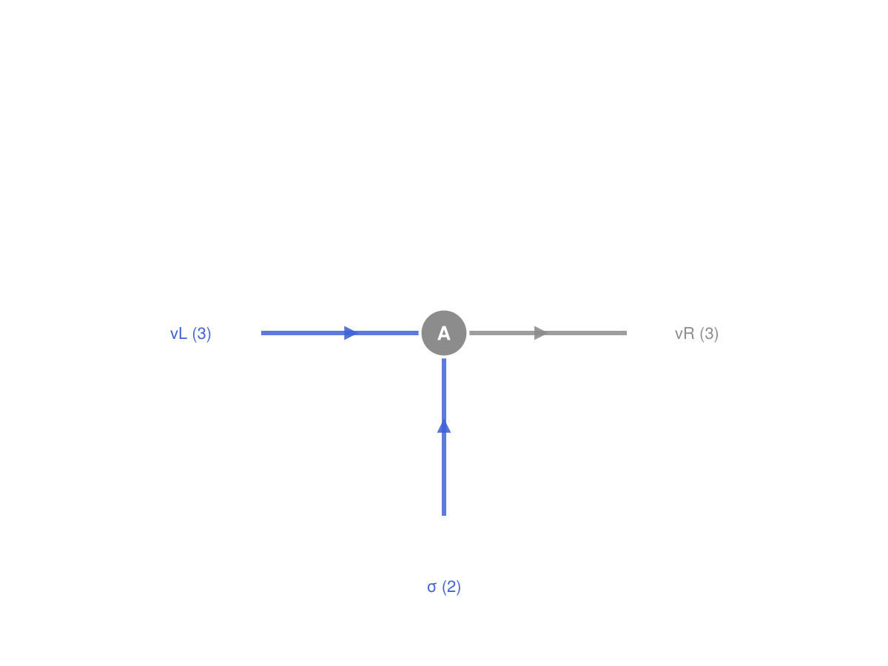
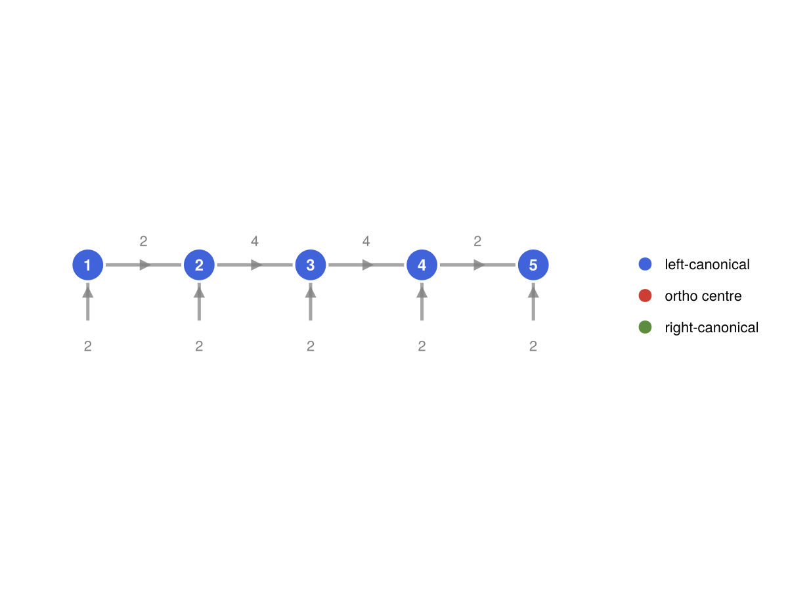

```@meta
EditURL = "gs1_tensors_and_indices.jl"
```

# GS-1 · Tensors & Indices

This page introduces the atomic object in Qritical: the **leg**. A leg carries three
things a `label`, a `loc` - `Upper`/`Lower` (to denote whether it is covariant or contravariant), and a `dim`. For the scope of this project we consider Tensors to just be multi-dimensional array with complex numbers. The tensors have a tuple of `legs`, one for each axis dimension. A Contraction is performed by matching index labels and locations.

---

````julia
using Qritical
using TensorOperations   # we make use of the command `@tensor` to perform contractions
using CairoMakie         # activates QriticalMakieExt and enables `draw`
````

## 1. The leg as the unit

Build one leg of each variance. `upper`/`lower` are the constructors; `dim`, `label`,
and `which_space` are the accessors.

````julia
vL = upper(:vL, 2)     # virtual bond leg: inward / incoming → Upper → domain (V')
σ  = upper(:σ, 2)      # physical spin-½ leg: always Upper in Qritical's MPS convention
````

````
Qritical.TIx{Qritical.Upper}(:σ, 2)
````

````julia
(dim(vL), label(vL), which_space(vL))   # (2, :vL, :domain)
````

````
(2, :vL, :domain)
````

````julia
(dim(σ), label(σ), which_space(σ))      # (2, :σ, :domain)
````

````
(2, :σ, :domain)
````

A leg matches by **label**, not by position — this is what keeps contraction robust
past two tensors, where "which axis is which" stops being obvious.

## 2. Wrapping data

A `QTensor` is a numeric array plus a tuple of legs, one per axis. It *is* an
`AbstractArray`, so it indexes and broadcasts like one, but it carries leg metadata.
Here is a rank-3 left-canonical MPS site tensor `A[vL, σ, vR]`.

````julia
d, χ = 2, 3
A = QTensor(randn(χ, d, χ), (upper(:vL, χ), upper(:σ, d), lower(:vR, χ)))
````

````
3×2×3 Qritical.QTensor{Float64, 3, Array{Float64, 3}}:
[:, :, 1] =
 -0.781899  1.18534
 -1.36284   0.467738
 -0.122606  0.180674

[:, :, 2] =
 -1.08227    0.110706
  0.972214  -0.538527
  0.482006  -1.82688

[:, :, 3] =
  0.304537  -0.733607
 -0.715076   0.490318
 -0.491622  -0.558671
````

````julia
(length(A.indices), ndims(A.data), size(A))
````

````
(3, 3, (3, 2, 3))
````

`QTensor` shares memory with the array it wraps — construction does not copy.
The legs follow the **left-canonical** convention: `vL` is `Upper` (incoming),
physical `σ` is `Upper` (always contravariant), and `vR` is `Lower` (outgoing
toward the next site).

`draw` renders this as a node diagram — blue stubs are `Upper` (incoming),
grey stubs are `Lower` (outgoing):

````julia
draw(A; name="A")
````





## 3. Variance is the convention, not decoration

| Leg orientation | Index | Role | Space |
|---|---|---|---|
| inward / incoming | `TIx{Upper}` | contravariant (superscript) | domain `V'` |
| outward / outgoing | `TIx{Lower}` | covariant (subscript) | codomain `V` |

Mnemonic (von Delft's arrow rule): Upper arrows point *in* (toward the tensor),
Lower arrows point *out* (away from it). In an MPS, bond arrows point toward
the orthogonality centre, so the variance of virtual legs is **form-dependent**
(left-canonical: Upper←…, right-canonical: …→Lower). Physical `σ` is *always*
Upper because it represents the contravariant ket-expansion coefficient
``A^{\\sigma}``.

Variance is *semantic*: two legs with the same label and dim but opposite variance
are **not** the same index:

````julia
upper(:α, 4) == lower(:α, 4)     # false — variance distinguishes them
````

````
false
````

## 4. Contraction

The Einstein rule: contract exactly one `Upper` against one `Lower` with the **same
label**. Build a neighbour `B` whose left virtual leg (`Upper :vR`) is the incoming
face of the bond, matching `A`'s outgoing `Lower :vR`.

````julia
B = QTensor(randn(χ, d, χ), (upper(:vR, χ), upper(:σ2, d), lower(:vR2, χ)))
````

````
3×2×3 Qritical.QTensor{Float64, 3, Array{Float64, 3}}:
[:, :, 1] =
  0.866672   0.546017
 -1.04799    0.0479252
 -0.343734  -0.0356733

[:, :, 2] =
  0.721629  -0.490173
 -0.777421   0.762505
 -1.18925   -0.252576

[:, :, 3] =
 -0.595082   0.670387
 -0.582929  -0.576174
  0.333717  -1.54906
````

Contract A and B over the shared bond `:vR`. The index names in `@tensor` are
positional labels — slot 3 of A and slot 1 of B both get the name `:vR` and are
summed. The result is a plain Array (TensorOperations does not auto-wrap in QTensor).

````julia
@tensor AB[vL, σ, σ2, vR2] := A[vL, σ, vR] * B[vR, σ2, vR2]

size(AB)   # (χ, d, d, χ) = (3, 2, 2, 3) — the bond :vR is summed away
````

````
(3, 2, 2, 3)
````

## 5. Partition vs variance

Two orthogonal notions, kept deliberately separate:

- **Variance** (`Upper`/`Lower`) is *intrinsic per leg*, fixed by orientation. It never
  changes and governs contractibility.
- **Partition** is a *per-operation* choice: which legs become rows vs columns when you
  matricise a rank-`k` tensor for an SVD. This is the `Bipartition`, applied by
  `group_legs`. It is the entry point to GS-2.

Cut `A[vL, σ, vR]` as `{vL, σ | vR}` and matricise:

````julia
bp = bipartition(AbstractIx[A.indices[1], A.indices[2]], A)   # left = {vL, σ}; right inferred = {vR}
M  = group_legs(A, bp)

size(M.data)    # (χ*d) × χ = 6×3 matrix; left legs → rows, right leg → columns
````

````
(6, 3)
````

The two output legs are fused `MulTIx` legs recording their constituents and the
product dim. `complement` and `bipartition` are the implicit-other-side conveniences
used above.

## 6. Edge cases

An order-0 (scalar) tensor has no legs; its value is read with an empty index.

````julia
s = QTensor(fill(3.0), ())
s.data[]        # 3.0
````

````
3.0
````

A `dim == 1` boundary bond is allowed (the open ends of a finite MPS). A leg whose dim
disagrees with the wrapped array's axis size throws `ArgumentError` at construction —
leg metadata and data can never silently drift apart.

````julia
try
    QTensor(randn(2, 3), (upper(:i, 2), lower(:j, 99)))  # dim 99 ≠ array axis 3
catch e
    e
end
````

````
ArgumentError("leg 2: array size 3 ≠ index dim 99")
````

## 7. Visualising a tensor network

A chain of site tensors connected by shared virtual bonds is a **Matrix Product State**.
`to_mps` decomposes a rank-``L`` state tensor into such a chain via iterated SVD.
`draw` lays the result out as a horizontal node diagram — sites coloured by canonical
form, bond dimensions annotated on each edge, physical leg dimensions below each node.

````julia
L = 5
ψ = QTensor(randn(ntuple(_ -> 2, L)),               # rank-L: one spin-½ leg per site
            ntuple(i -> upper(Symbol(:s, i), 2), L))
mps = to_mps(ψ)                                      # left-canonical by default

f = draw(mps)
resize_to_layout!(f)   # shrink the figure to the diagram's true extent
f
````





---

*cf. quimb's tensor basics: same idea that a shared index name forms a bond, but here
each leg is variance-typed, so contractibility is checked rather than assumed.*

---

*This page was generated using [Literate.jl](https://github.com/fredrikekre/Literate.jl).*

