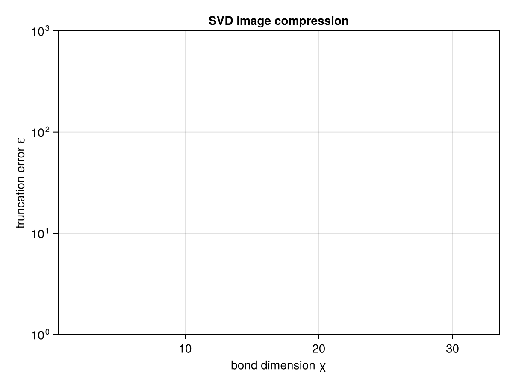

```@meta
EditURL = "gs2_svd_and_truncation.jl"
```

# GS-2 · SVD & Truncation

Prerequisite: GS-1 (legs, `QTensor`, `Bipartition`).

The whole page is one function — `do_svd(A, bp, trunc)` — and one idea: the **return
type is the correctness guarantee**. No truncation gives you a `FullSVD` (exact);
any truncation gives you a `ReducedSVD` that carries its own error `ε`, so the
approximation is impossible to forget.

---

````julia
using Qritical
using LinearAlgebra
using TensorOperations
using CairoMakie
````

## 1. One call, exact by default

Wrap a matrix as a rank-2 `QTensor`, cut it into {row | col}, and SVD with `NoTrunc()`.
The `NoTrunc` *type* is the promise of exactness — the result is a `FullSVD` with no
error field to carry.

````julia
m, n = 6, 4
Amat = randn(m, n)
A = QTensor(Amat, (upper(:i, m), lower(:j, n)))
````

````
6×4 QTensor{Float64, 2, Matrix{Float64}}:
  0.692867   0.876762  1.53543    0.166821
 -1.00793    0.195413  0.313048  -0.191783
 -0.110579   2.49386   0.676153  -1.02802
 -0.246108   0.378749  0.913469  -0.701485
 -0.906965  -1.76384   0.194754   0.094344
  1.11547    0.728755  0.827007   1.14628
````

````julia
bp = bipartition(AbstractIx[A.indices[1]], A)   # left = {:i}; right inferred = {:j}
F  = do_svd(A, bp, NoTrunc())

typeof(F)                                # FullSVD
````

````
FullSVD
````

````julia
svals = F.Σ.data.diag                   # the singular values (Σ.data is a Diagonal)
length(svals)                           # == min(m, n) = 4
````

````
4
````

Reconstruction check — `U·Σ·Vd ≈ A`:
U gets legs (upper(:i, m), lower(:λL, r)); Σ gets (upper(:λL, r), upper(:λR, r));
Vd gets (lower(:λR, r), lower(:j, n)).

````julia
@tensor Arec[i, j] := F.U[i, λL] * F.Σ[λL, λR] * F.Vd[λR, j]
maximum(abs, Arec .- Amat)               # ≈ machine epsilon — reconstruction is exact
````

````
8.881784197001252e-16
````

## 2. An SVD across a cut *is* a Schmidt decomposition

The same call on a higher-rank **state** tensor is the Schmidt decomposition: the
`Bipartition` you choose is the entanglement cut, and the singular values are the
Schmidt coefficients. Here is a rank-3 state `Ψ[a, b, c]` cut as `{a | b, c}`.

In Qritical's convention, physical / state indices are `Upper` (contravariant
ket-expansion coefficients).

````julia
Ψ = QTensor(randn(2, 2, 2), (upper(:a, 2), upper(:b, 2), upper(:c, 2)))
cut = bipartition(AbstractIx[Ψ.indices[1]], Ψ)     # {a | b,c}
S = do_svd(Ψ, cut, NoTrunc())

schmidt = S.Σ.data.diag
schmidt ./ sqrt(sum(abs2, schmidt))      # normalised Schmidt coefficients across the cut
````

````
2-element Vector{Float64}:
 0.9334309308213303
 0.35875715656419255
````

`group_legs` did the matricise-then-SVD internally; you only ever named the cut.

## 3. Truncation, and the error it costs

Three strategies, one interface. Only `NoTrunc` returns a `FullSVD`; the others return
a `ReducedSVD` whose `ε` is the 2-norm of the discarded singular values, and whose `r`
is the kept rank.

| `AbstractTrunc` | keeps | returns |
|---|---|---|
| `NoTrunc()` | all | `FullSVD` |
| `MaxBondDimTrunc(χ)` | at most `χ` values | `ReducedSVD` |
| `ValCutoffTrunc(δ)` | values `> δ` | `ReducedSVD` |

Sweep the bond cap and watch the error rise as you keep fewer values.

````julia
for χ in 1:length(svals)
    R = do_svd(A, bp, MaxBondDimTrunc(χ))
    println("χ = $χ   kept r = $(R.r)   ε = $(round(R.ε; sigdigits=3))")
end
````

````
χ = 1   kept r = 1   ε = 2.89
χ = 2   kept r = 2   ε = 1.8
χ = 3   kept r = 3   ε = 0.695
χ = 4   kept r = 4   ε = 0.0

````

`ε` is exactly the Frobenius distance `‖A − U·Σ·Vd‖_F` you traded for the smaller bond.

## 4. Application: low-rank image compression

The classic SVD demo. We use a smooth synthetic grayscale image so the page has no
image-file dependency. Truncating the SVD keeps only the largest singular directions —
the same reason low-entanglement quantum states compress well as MPS.

````julia
gridx = range(-3, 3; length = 128)
img = [exp(-(x^2 + y^2)/4) * cos(2x) * sin(1.5y) for y in gridx, x in gridx]
Aimg = QTensor(img, (upper(:row, size(img,1)), lower(:col, size(img,2))))
bpimg = bipartition(AbstractIx[Aimg.indices[1]], Aimg)

errs = Float64[]
χs = (2, 4, 8, 16, 32)
for χ in χs
    R = do_svd(Aimg, bpimg, MaxBondDimTrunc(χ))
    push!(errs, R.ε)
end
````

````julia
fig = Figure()
ax = Axis(fig[1,1]; xlabel = "bond dimension χ", ylabel = "truncation error ε",
          yscale = log10, title = "SVD image compression")
scatterlines!(ax, collect(χs), errs)
fig
````





---

### Deferred: §5 entanglement entropy

Product state → `S = 0`; Bell pair → `1` bit, via `entanglement_entropy(; base = 2)`
on a `SchmidtSpectrum`. Deferred until `SchmidtSpectrum` is fully wired; see
`entanglement_entropy` and `entanglement_spectrum` in the API reference.

*cf. quimb's `tensor_split`: Qritical folds matricise + SVD + truncate into one typed
call, and pushes the truncation error into the return type.*

---

*This page was generated using [Literate.jl](https://github.com/fredrikekre/Literate.jl).*

