```@meta
EditURL = "gs3_drawing_tensor_networks.jl"
```

# GS-3 · Drawing Tensor Networks

The [`draw`](@ref) methods from GS-1 render a `QTensor` or a `FiniteMPS`
automatically. Sometimes you instead want to *hand-draw* a diagram — a bespoke
tensor network for a figure, a talk, or a derivation on paper made precise.
Qritical ships a small schematic-drawing DSL for exactly this, in the spirit of
[quimb's `schematic` module](https://quimb.readthedocs.io/en/latest/examples/schematic-demo.html).

The whole API is five verbs threaded through a canvas:

| Verb | Draws |
|------|-------|
| [`node!`](@ref) | a named tensor node (shape encodes tensor kind — §5) |
| [`wire!`](@ref) | a bond line between two tensors |
| [`stub!`](@ref) | a dangling / open (physical) leg |
| [`region!`](@ref) | a translucent blob grouping tensors |
| [`note!`](@ref) | a free-floating text annotation |

Everything is drawn in **data coordinates**, so shapes stay proportional, and
the canvas auto-expands its view box as you add elements — nothing gets cropped.

---

````julia
using Qritical
using CairoMakie   # activates QriticalMakieExt and enables the drawing verbs

# Julia-brand palette (github.com/JuliaLang/julia-logo-graphics) — the same
# colours the drawing verbs use by default, so hand-drawn figures match `draw`.
jblue   = RGBf(0.251, 0.388, 0.847)
jred    = RGBf(0.796, 0.235, 0.200)
jgreen  = RGBf(0.220, 0.596, 0.149)
jpurple = RGBf(0.584, 0.345, 0.698)
jgrey   = RGBf(0.55, 0.55, 0.58)
jgold   = RGBf(0.85, 0.65, 0.13);   # trailing ; suppresses the colour-swatch output
````

````
Precompiling packages...
   4906.9 ms  ✓ Qritical → QriticalMakieExt
  1 dependency successfully precompiled in 6 seconds. 347 already precompiled.

````

## 1. A canvas, a tensor, a bond

[`schematic`](@ref) returns an empty canvas. Every verb takes it as the first
argument, mutates it, and returns it again (so calls can be chained). Tensors
are placed at explicit `(x, y)` coordinates and remembered by a `Symbol` name;
bonds and partitions then refer to tensors by that name rather than by position.

````julia
s = schematic(; figure_kw=(size=(420, 240),))
node!(s, :A, (0, 0))
node!(s, :B, (1.4, 0))
wire!(s, :A, :B; label=L"\chi")
s.fig
````


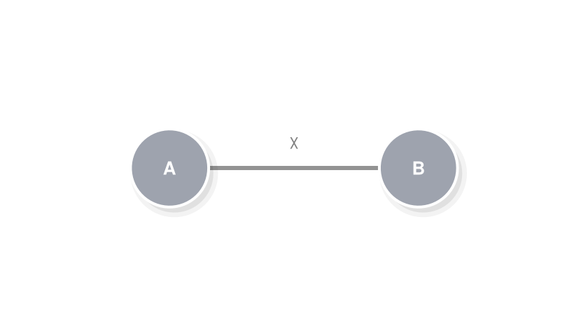


The canvas is `s.fig` — a plain `Makie.Figure` you can `save(...)`, embed, or
display. Notice the bond is drawn *behind* the circles: nodes always sit on top.

## 2. Directed bonds and open legs

A tensor's *open* legs — physical indices with no partner — are drawn with
[`stub!`](@ref), pointing in a direction given either as an angle (radians) or a
`(dx, dy)` vector. Arrowheads follow Qritical's variance convention: an
`into=true` leg points *toward* the tensor (an incoming `Upper` index).

````julia
s = schematic(; figure_kw=(size=(560, 260),))
for (i, name) in enumerate((:A, :B, :C))
    node!(s, name, (i - 1, 0); color=jblue)
    stub!(s, name, π/2; label=L"\sigma_{%$i}", arrow=true, into=true)   # physical leg, pointing in
end
wire!(s, :A, :B; label=L"\chi", arrow=true)
wire!(s, :B, :C; label=L"\chi", arrow=true)
s.fig
````


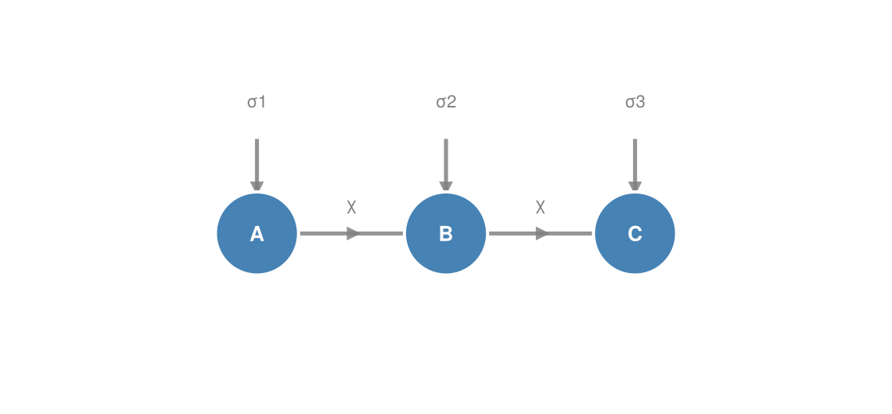


This is the canonical picture of a three-site MPS: a horizontal spine of virtual
bonds with physical legs hanging off each site. The bond arrows show the flow of
the gauge (here left-to-right, as in a left-canonical state).

## 3. Partitions — the whole point

The reason to hand-draw is usually to **highlight a grouping**: a bipartition
cut, an entanglement region, a block to be coarse-grained. [`region!`](@ref)
takes a list of tensor names and wraps them in a translucent rounded blob — the
convex hull of their positions, inflated and smoothed. The blob is always drawn
behind everything else, so it reads as a background region.

Here is the bipartition ``\{1,2,3 \mid 4,5,6\}`` of a six-site chain — the cut
whose Schmidt spectrum GS-2 truncates:

````julia
s = schematic(; figure_kw=(size=(720, 300),))
for i in 1:6
    node!(s, Symbol(:t, i), (i - 1, 0); color=jgrey)
    stub!(s, Symbol(:t, i), π/2; length=0.45)
end
for i in 1:5
    wire!(s, Symbol(:t, i), Symbol(:t, i + 1))
end
region!(s, [Symbol(:t, i) for i in 1:3]; color=jblue,  label="block L")
region!(s, [Symbol(:t, i) for i in 4:6]; color=jred,     label="block R")
note!(s, (2.5, -1.15), "the cut bond carries the Schmidt spectrum"; fontsize=11, color=:gray)
s.fig
````


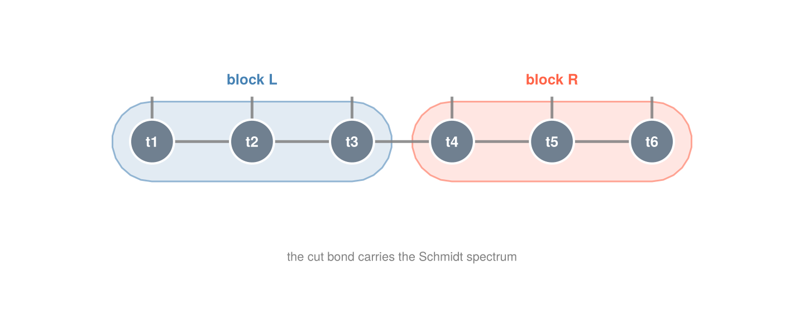


## 4. Different partitions of the same network

The same tensors can be cut many ways, and the drawing DSL makes each cut a
one-liner. Below, a 2×3 grid of tensors (think a small PEPS patch or a two-leg
ladder) is shown twice: once cut **vertically** into left/right halves, once cut
**horizontally** into top/bottom rows. Only the `region!` calls differ.

````julia
# helper: lay down the same 2×3 grid on any canvas
function grid_2x3!(s)
    for r in 1:2, c in 1:3   # rows spaced 1.3 apart — leaves room for partition labels
        node!(s, Symbol(:g, r, c), (c - 1, 1.3 * (r - 1)); radius=0.18, color=jgrey)
    end
    for r in 1:2, c in 1:2                       # horizontal bonds
        wire!(s, Symbol(:g, r, c), Symbol(:g, r, c + 1))
    end
    for c in 1:3                                 # vertical (rung) bonds
        wire!(s, Symbol(:g, 1, c), Symbol(:g, 2, c))
    end
    return s
end

sv = schematic(; figure_kw=(size=(460, 320),))
grid_2x3!(sv)
region!(sv, [Symbol(:g, r, c) for r in 1:2, c in 1:1]; color=jgreen, label="A")
region!(sv, [Symbol(:g, r, c) for r in 1:2, c in 2:3]; color=jpurple, label="B")
note!(sv, (1.0, -0.95), "vertical cut"; fontsize=12, color=:gray)
sv.fig
````


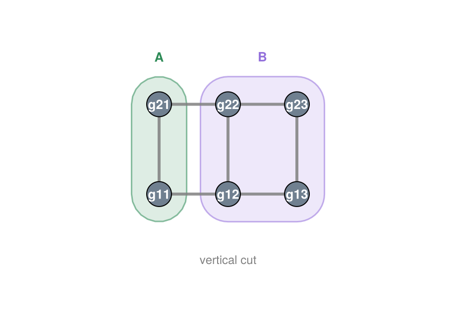


````julia
sh = schematic(; figure_kw=(size=(460, 320),))
grid_2x3!(sh)
region!(sh, [Symbol(:g, 1, c) for c in 1:3]; color=jpurple, label="bottom")
region!(sh, [Symbol(:g, 2, c) for c in 1:3]; color=jblue, label="top")
note!(sh, (1.0, -0.95), "horizontal cut"; fontsize=12, color=:gray)
sh.fig
````


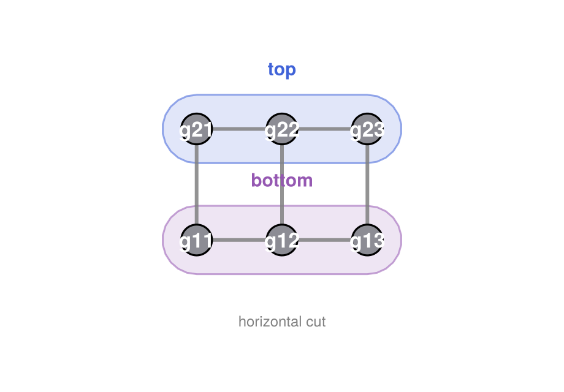


Because `region!` just takes whatever tensors you name, overlapping and
nested regions work too — draw a large faint blob over the whole network and a
smaller saturated one over a sub-block to show a region inside a region.

## 5. Tensor-kind shapes

A circle says nothing about what a tensor *is*. [`node!`](@ref)'s `shape`
keyword makes the **silhouette encode the operator's index structure**, so a
diagram reads correctly even without labels.

| `shape` | Geometry | Meaning |
|:--------|:---------|:--------|
| `:general`  | circle    | a generic tensor, no special structure |
| `:diagonal` | diamond   | a diagonal matrix, e.g. a singular-value spectrum ``\Sigma`` |
| `:unitary`  | D-arch    | ``U`` with ``UU^\dagger = U^\dagger U = I`` — a flat base with a domed top |
| `:isometry` | trapezoid | ``W`` with ``W^\dagger W = I`` but ``WW^\dagger \neq I`` — the dimensions *differ*, so the wide base is the larger index, tapering to a narrow top on the *contracted* (smaller) side |

The distinction between the last two is the whole point: a **unitary is square**
(rows == columns), so it gets the flat-based **D-arch**; an **isometry is
rectangular** (``W^\dagger W = I`` but ``WW^\dagger \neq I``), so it gets the
asymmetric wedge. The trapezoid's narrow end points (via `rotation`, in radians)
toward the smaller index, so stacking two mirrored wedges base-to-base is
exactly the picture of ``W^\dagger W`` collapsing to the identity — and it never
tapers to a *point*, since that would mean the contracted index has dimension one.

````julia
s = schematic(; figure_kw=(size=(760, 240),))
node!(s, :U0, (0, 0);   shape=:general,  label=L"M")
node!(s, :S,  (1.6, 0); shape=:diagonal, label=L"\Sigma", color=jgold)
node!(s, :U,  (3.2, 0); shape=:unitary,  label=L"U", color=jblue)
node!(s, :Wr, (4.8, 0); shape=:isometry, rotation=0.0, label=L"W", color=jgreen)
node!(s, :Wl, (6.4, 0); shape=:isometry, rotation=π,   label=L"W", color=jred)
for (x, txt) in zip(0:1.6:6.4, ("general", "diagonal (Σ)", "unitary", "isometry →", "isometry ←"))
    note!(s, (x, -0.75), txt; fontsize=13, color=:gray)
end
s.fig
````


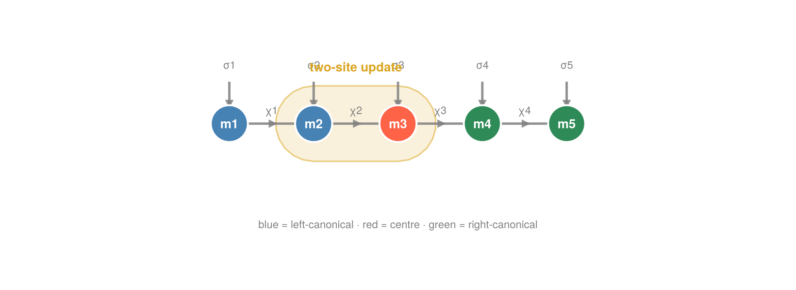


`draw(mps::FiniteMPS)` from GS-1 already uses this: since Qritical tracks
each site's canonical form, left- and right-canonical sites are drawn as
isometry wedges automatically — no manual shape bookkeeping required.

## 6. Putting it together

A slightly richer figure: a five-site MPS with the orthogonality centre marked,
a bond label on every link, isometry wedges on the canonical sites, and a
partition highlighting the two-site window an algorithm like DMRG or TEBD
updates at each step.

````julia
s = schematic(; figure_kw=(size=(820, 300),))
site_shapes    = [:isometry, :isometry, :general, :isometry, :isometry]
site_rotations = [0.0, 0.0, 0.0, π, π]      # left-canonical → narrow end right, right-canonical → narrow end left
colors         = [jblue, jblue, jred, jgreen, jgreen]
for i in 1:5
    node!(s, Symbol(:m, i), (i - 1, 0);
            shape=site_shapes[i], rotation=site_rotations[i], color=colors[i])
    # σ enters the flat base of a canonical site (base=true bends it in); the
    # centre is a plain circle, so its leg just goes straight up.
    stub!(s, Symbol(:m, i), π/2; label=L"\sigma_{%$i}", arrow=true, into=true, length=0.5, base=true)
end
for i in 1:4
    wire!(s, Symbol(:m, i), Symbol(:m, i + 1); label=L"\chi_{%$i}", arrow=true)
end
region!(s, [:m2, :m3]; color=jgold, padding=0.3, label="two-site update")
note!(s, (2.0, -1.2), "blue = left-canonical · red = centre · green = right-canonical";
      fontsize=13, color=:gray)
s.fig
````


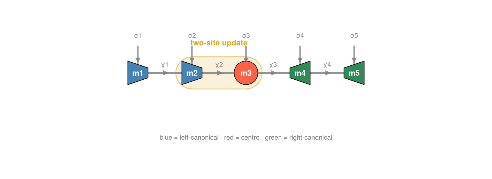


## 7. Canonicalization as a sweep

Bringing an MPS to canonical form is an *iterative* process, and it is the
cleanest illustration of why the isometry wedge earns its own shape. A left
sweep walks rightward through the chain; at each site it splits the local
tensor by an SVD (or QR),

```math
M_i = A_i \, \Sigma \, V^\dagger ,
```

keeps the left factor ``A_i`` — a **left-isometry**, ``A_i^\dagger A_i = I`` — in
place, and absorbs the remainder ``\Sigma V^\dagger`` into the next site. So one
site at a time, a generic tensor (circle) is *replaced* by an isometry (wedge),
with the diagonal ``\Sigma`` (diamond) as the leftover that moves rightward.

````julia
step = schematic(; figure_kw=(size=(720, 260),))
node!(step, :M, (0, 0); shape=:general, radius=0.30, color=jgrey, label=L"M_i")
stub!(step, :M, -π/2; length=0.5, label=L"\sigma")
wire!(step, (-0.9, 0), :M)
note!(step, (1.15, 0), "="; fontsize=24, color=:gray)
node!(step, :A, (2.2, 0); shape=:isometry, rotation=0.0, radius=0.30, color=jgreen, label=L"A_i")
stub!(step, :A, -π/2; length=0.5, label=L"\sigma", base=true)   # σ bends into the wide base
wire!(step, (1.3, 0), :A)                                # vL bond also enters the base
node!(step, :Σ, (3.4, 0); shape=:diagonal, radius=0.26, color=jgold, label=L"\Sigma")
wire!(step, :A, :Σ)
node!(step, :R, (4.6, 0); shape=:general, radius=0.30, color=jgrey, label=L"V^\dagger")
wire!(step, :Σ, :R)
wire!(step, :R, (5.5, 0))
note!(step, (4.0, -1.25), "ΣV† is absorbed into site i+1"; fontsize=13, color=:gray)
step.fig
````


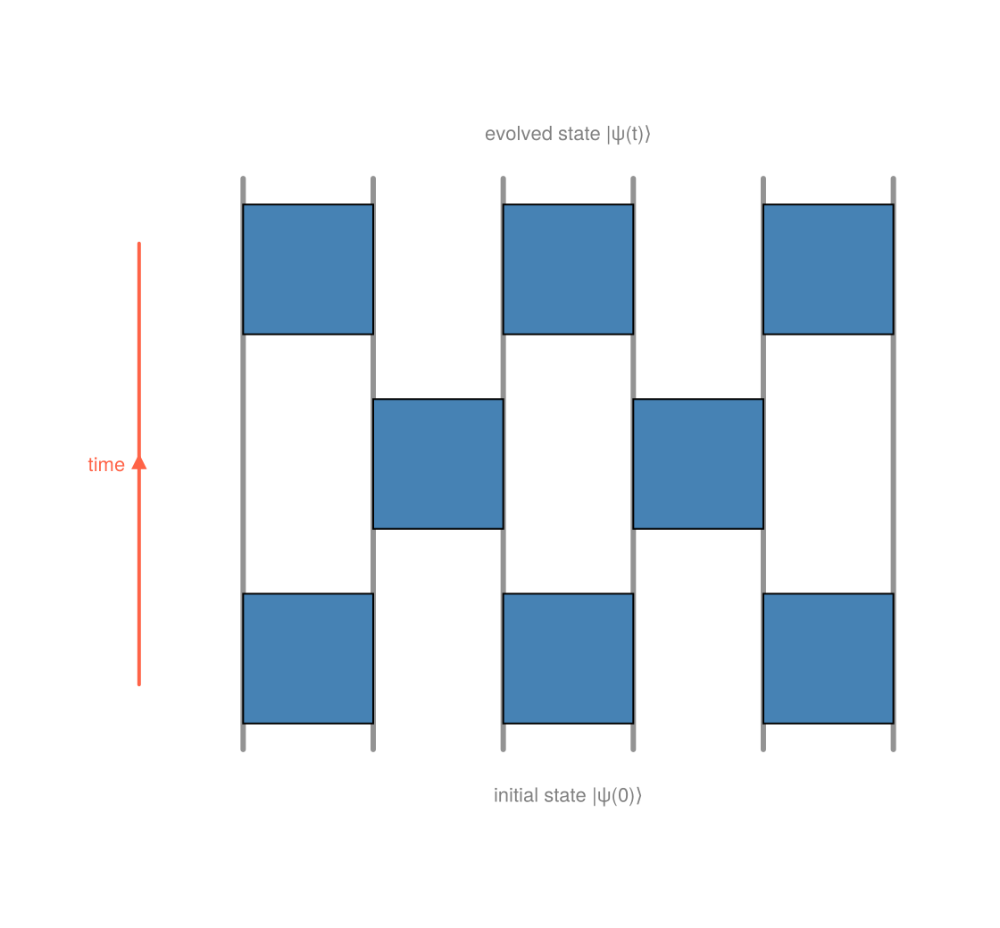


The left factor is a genuine **left-isometry**: contracting ``A_i`` with its
conjugate over the whole wide base — both the ``\sigma`` and the left bond —
leaves the identity on the surviving (narrow) bond. Drawn in the wedge language,
two mirrored copies meet base-to-base and collapse to a bare line:

````julia
iso = schematic(; figure_kw=(size=(560, 300),))
node!(iso, :A,  (0,  0.6); shape=:isometry, rotation=π/2,  radius=0.32, color=jgreen, label=L"A_i")
node!(iso, :Ad, (0, -0.6); shape=:isometry, rotation=-π/2, radius=0.32, color=jgreen, label=L"A_i^\dagger")
wire!(iso, :A, :Ad; linewidth=4)                 # contracted (σ, vL) — the bases meet
stub!(iso, :A,   π/2; length=0.4)                 # free (narrow) bond out the top
stub!(iso, :Ad, -π/2; length=0.4)                 # free (narrow) bond out the bottom
note!(iso, (0.9, 0), "="; fontsize=24, color=:gray)
wire!(iso, (1.5, -1.05), (1.5, 1.05))            # identity = a straight through-line
note!(iso, (0.0, -1.4), L"A_i^\dagger A_i = I"; fontsize=15, color=:gray)
note!(iso, (1.5, -1.4), "identity"; fontsize=13, color=:gray)
iso.fig
````


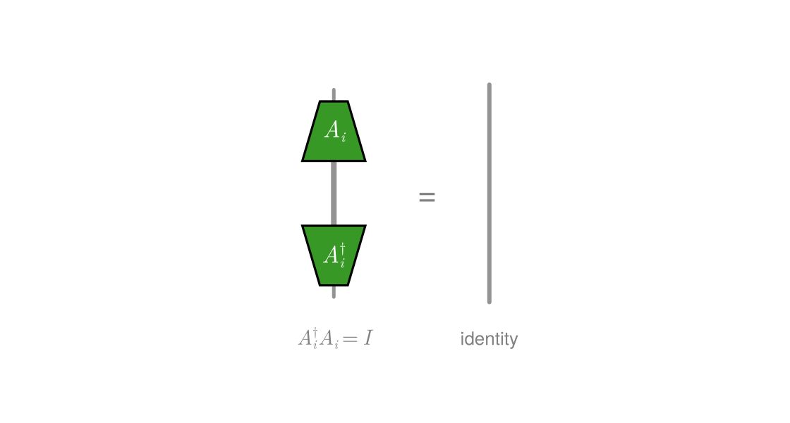


Repeating this across the chain turns the whole state left-canonical. Stacking
the intermediate states as rows makes the front of isometries visibly sweep in
from the left — exactly what [`canonicalize`](@ref) does under the hood. After
`k` steps the first `k` sites are wedges and the rest are still circles:

````julia
sweep = schematic(; figure_kw=(size=(640, 470),))
L = 5
Δy = 1.3
for k in 0:4
    y = -k * Δy
    for i in 1:L
        iso = i <= k                                   # sites 1..k already left-canonical
        node!(sweep, Symbol(:c, k, :_, i), (Float64(i), y);
                shape = iso ? :isometry : :general, rotation = 0.0, radius = 0.26,
                color = iso ? jgreen : jgrey, label = "")
    end
    for i in 1:(L - 1)
        wire!(sweep, Symbol(:c, k, :_, i), Symbol(:c, k, :_, i + 1))
    end
    note!(sweep, (0.5, y), L"k = %$k"; fontsize=14, color=:gray, align=(:right, :center))
end
note!(sweep, (3.0, 0.9), "start: every site is a generic tensor"; fontsize=13, color=:gray)
note!(sweep, (3.0, -4Δy - 0.9), "end: sites 1–4 are left-isometries, site 5 holds the norm";
      fontsize=12, color=:gray)
stub!(sweep, (-0.2, 0.4), -π/2; length=4Δy + 0.5, arrow=true, color=jred)
note!(sweep, (-0.6, -2Δy), "sweep"; fontsize=13, color=jred)
sweep.fig
````


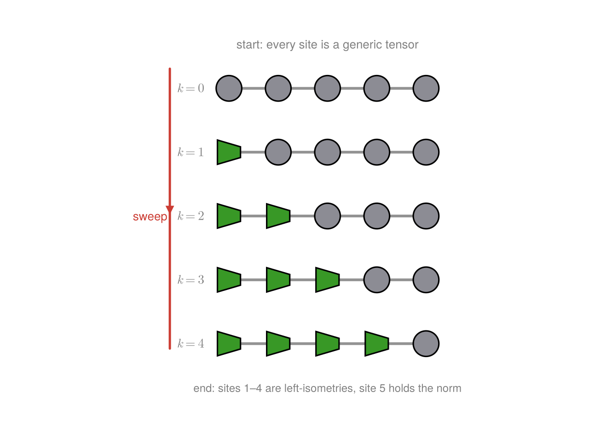


## 8. Stacked layers — a TEBD brick-wall circuit

quimb's schematic gallery has a *pseudo-3D* figure: many rows of a tensor
network stacked to depict an iterative process. The 3D projection is optional
eye-candy; the useful part — **repeated layers** — reads perfectly well in 2D.

Here each layer is a row of two-site gates in the brick-wall pattern of a
[`TEBD`](@ref) (time-evolving block decimation) circuit. Time runs *upward*,
and successive layers alternate between the even and odd bonds of a six-site
chain — the standard first-order Trotter split of ``e^{-iHt}``.

````julia
# a two-site gate on sites (a, a+1) at height `y`. A two-site gate is a *square*
# unitary on the combined d²-dimensional space, so it draws as a `:unitary` D-arch.
# Radius 0.6 makes it a touch wider than the wire gap, so the two wires at x = a
# and x = a+1 run up *into* the gate body (behind the opaque node), entering the
# flat base and leaving through the dome — not grazing the edges.
gate!(s, a, y) = node!(s, Symbol(:g, a, :_, round(Int, 10y)), (a + 0.5, y);
                         shape=:unitary, radius=0.6, label="", color=jblue)

s = schematic(; figure_kw=(size=(560, 520),))
for x in 1:6                                     # six physical wires running through time
    wire!(s, (Float64(x), 0.3), (Float64(x), 4.7))
end
for a in (1, 3, 5); gate!(s, a, 1.0); end        # layer 1 — odd bonds (1,2)(3,4)(5,6)
for a in (2, 4);    gate!(s, a, 2.5); end         # layer 2 — even bonds (2,3)(4,5)
for a in (1, 3, 5); gate!(s, a, 4.0); end         # layer 3 — odd bonds again
note!(s, (3.5, -0.05), "initial state |ψ(0)⟩"; fontsize=13, color=:gray)
note!(s, (3.5,  5.05), "evolved state |ψ(t)⟩"; fontsize=13, color=:gray)
stub!(s, (0.2, 0.8), π/2; length=3.4, arrow=true, color=jred)   # upward "time" arrow
note!(s, (-0.05, 2.5), "time"; fontsize=13, color=jred)
s.fig
````


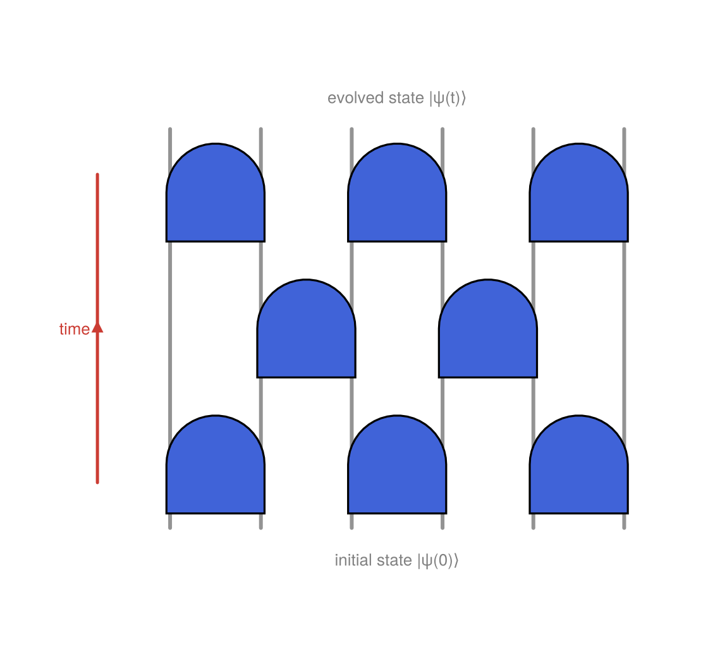


The wires are [`wire!`](@ref)s drawn behind the nodes, the gates are `:unitary`
D-arches wide enough that the two wires they act on run up into the gate body,
and the layer spacing lets the wires show through between them — nothing beyond
the verbs from §1–2, just stacked.

### Labeled gates

So far the gates are anonymous. Passing a `label` names each one — here the
bond Hamiltonian it exponentiates, ``h_{a,a+1}``, so the diagram doubles as a
legend for *which* term acts *where*. The odd/even layers reuse the same bond
terms, so the labels repeat down the circuit, making the first-order Trotter
pattern ``e^{-iH t} \approx \prod (\text{odd})\,\prod(\text{even})\,\prod(\text{odd})``
legible at a glance.

````julia
# (bond-column a, height y, label) for every gate in the brick-wall
gates = [(1, 1.0, L"h_{12}"), (3, 1.0, L"h_{34}"), (5, 1.0, L"h_{56}"),   # layer 1 — odd
         (2, 2.5, L"h_{23}"), (4, 2.5, L"h_{45}"),                        # layer 2 — even
         (1, 4.0, L"h_{12}"), (3, 4.0, L"h_{34}"), (5, 4.0, L"h_{56}")]   # layer 3 — odd

s = schematic(; figure_kw=(size=(560, 520),))
for x in 1:6
    wire!(s, (Float64(x), 0.3), (Float64(x), 4.7))
end
for (a, y, lbl) in gates
    node!(s, Symbol(:lg, a, :_, round(Int, 10y)), (a + 0.5, y);
            shape=:unitary, radius=0.6, label=lbl, labelcolor=:white,
            color=jblue, fontsize=15)
end
note!(s, (3.5, -0.15), "each gate = exp(−i δt · h_bond)"; fontsize=13, color=:gray)
note!(s, (3.5, 5.05), "labels repeat as the odd/even layers alternate"; fontsize=12, color=:gray)
s.fig
````


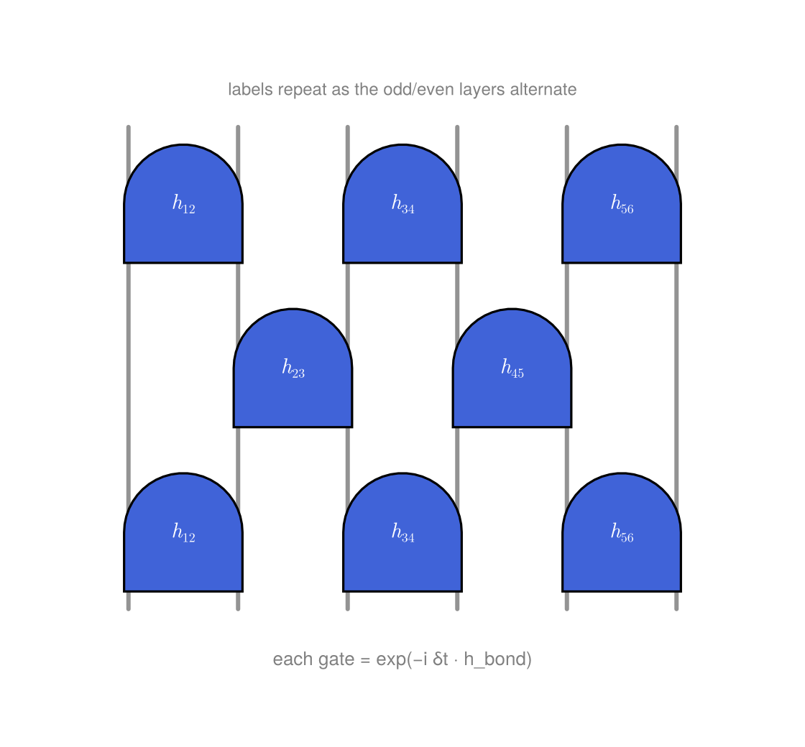


The label sits at the centre of the D-arch, so it stays legible on the gate.
Colour the layers differently, or drop a [`region!`](@ref) over one row to
highlight a single Trotter step, and the same skeleton adapts to whatever
iterative process you need to picture.

---

*The API mirrors quimb's `schematic.Drawing` — `node!`/`wire!`/`stub!` for the
skeleton, `region!` for the regions — but stays in pure Julia + Makie, so the
same figures render in the docs, a notebook, or a paper with no extra tooling.*

---

*This page was generated using [Literate.jl](https://github.com/fredrikekre/Literate.jl).*

