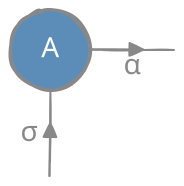
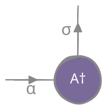
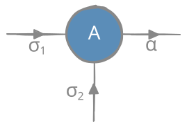
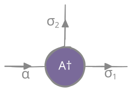

# Notation

## Covariant indexing
Varies among papers and researchers. Throughout this project we will use the covariant notation convention as presented in [altland_vondelft_2019](@cite) (indices of vector as subscripts, indices of vector components as superscripts, subscripts as outgoing arrows, superscripts as incoming arrows).

||        |    Vector space ``\mathcal{H}``     |       Dual space ``\mathcal{H}^*``       |
|-------------| ----------- | :------------------------: | :------------------------: |
|| **Index**       | on the ket - down |    on the bra - up     |
||        |        component of ket - up        |component of bra - down |
||Simplified notation|subscript indices as ket names|superscript indices as bra names|

### Single site
|        |    ``\mathcal{H}``     |      ``\mathcal{H}^*``       |
| ----------- | :------------------------: | :------------------------: |
| basis   | ``\ket{\varphi_\sigma}``| ``\bra{\varphi^\sigma}``     |
|     | ``\ket{\sigma}``| ``\bra{\sigma}``     |
| linear combination  |    ``\alpha``: basis kets (down)    |       ``\alpha``: basis bras (up)        |
|        | ``\sigma``: components of kets (up) |  ``\sigma``: components of bras (down)   |
|    |        ``\begin{aligned} \ket{\phi_\alpha} &= \sum_{\sigma} \ket{\varphi_\sigma} A^\sigma_\alpha \end{aligned}``| ``\begin{aligned} \bra{\phi^\alpha} &= \sum_{\sigma} \left(A^\sigma_\alpha\right)^{\dagger} \bra{\varphi^\sigma} \\ &= \sum_{\sigma} \left(A^{\dagger}\right)_\sigma^\alpha \bra{\varphi^\sigma} \end{aligned}`` |
|      | ``\ket{\alpha}=\ket{\sigma} A^\sigma_\alpha``| ``\bra{\alpha}=\left(A^{\dagger}\right)_\sigma^\alpha \bra{\sigma}``     |
|coefficient matrix| ``\braket{\sigma}{\alpha} = A^\sigma_\alpha``| ``\braket{\alpha}{\sigma}=\left(A^{\dagger}\right)_\sigma^\alpha``     |

### Multiple sites
|        |    ``\mathcal{H}_1\otimes \cdots \otimes \mathcal{H}_N``     |     ``\mathcal{H}^1\otimes \cdots \otimes \mathcal{H}^N``       |
| ----------- | :------------------------: | :------------------------: |
| direct product basis     | ``\ket{\varphi_{\vec{\sigma}}} \equiv \ket{\varphi_{\sigma_1 \sigma_2 \cdots \sigma_N}} \equiv \ket{\varphi_{\sigma_N}} \otimes \cdots \ket{\varphi_{\sigma_1}}`` |   ``\bra{\varphi^{\vec{\sigma}}} \equiv \bra{\varphi^{\sigma_1 \sigma_2 \cdots \sigma_N}} \equiv \bra{\varphi^{\sigma_1}} \otimes \cdots \bra{\varphi^{\sigma_N}}``    |
| linear combination       |  ``\ket{\Phi_\alpha} = \sum_{\vec{\sigma}} \ket{\varphi_{\sigma_1 \sigma_2 \cdots \sigma_N}} A^{\sigma_1 \sigma_2 \cdots \sigma_N}_{\alpha}``   | ``\bra{\Phi^\alpha} = \sum_{\vec{\sigma}} {A^*}^{\alpha}_{\sigma_N \sigma_{N-1} \cdots \sigma_1} \bra{\varphi^{\sigma_1 \sigma_2 \cdots \sigma_N}}`` |

## Coefficient tensors
- ``\ket{\alpha}=\ket{\sigma} A^\sigma_\alpha \qquad`` and ``\qquad \bra{\alpha}=\left(A^{\dagger}\right)_\sigma^\alpha \bra{\sigma}``

||||||
|:---:|:---:|:---:|:---:|:---:|
|``A^\sigma_\alpha=\braket{\sigma}{\alpha} ``  | ||``\left(A^{\dagger}\right)_\sigma^\alpha=\braket{\alpha}{\sigma}``||

- ``\ket{\alpha}=\ket{\sigma_2}\otimes\ket{\sigma_1} A^{\sigma_1\sigma_2}_\alpha \qquad`` and ``\qquad \bra{\alpha}=\left(A^{\dagger}\right)_{\sigma_2\sigma_1}^\alpha \bra{\sigma_1}\otimes\bra{\sigma_2}``

||||||
|:---:|:---:|:---:|:---:|:---:|
|``A^{\sigma_1\sigma_2}_\alpha=\bra{\sigma_1}\otimes\braket{\sigma_2}{\alpha} ``  | ||``\left(A^{\dagger}\right)_{\sigma_2\sigma_1}^\alpha=\braket{\alpha}{\sigma_2}{\otimes}\ket{\sigma_1}``||
